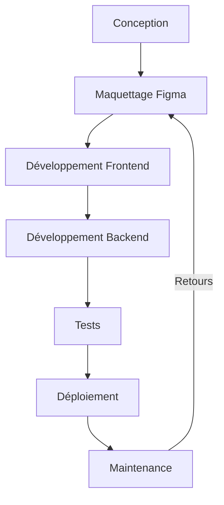
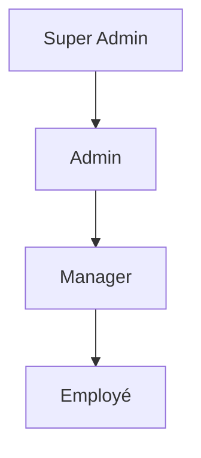

# **StaffEase Pro**
## *Une Solution Modulaire de Gestion des Plannings, des Signatures Numériques et des Ressources Humaines pour le Secteur Hôtelier et Touristique*

**Présenté par :** Marco Antonio PINNA
**Date :** Juillet 2026
**Contact :**
- Email : pinna.marcoantonio@kilovol.com
- Téléphone : +33 744907701
- Site web : [https://cvmap.page.gd](https://cvmap.page.gd)
- GitHub : [https://github.com/MapDev76](https://github.com/MapDev76)
- Application : [https://staffeasepro.page.gd](https://staffeasepro.page.gd)

---

## **📄 Sommaire**

### **1. Introduction**
- 1.1 Contexte et Motivation
  - 1.1.1 Contexte du Secteur Hôtelier et Problématiques Identifiées
  - 1.1.2 Gestion des Présences et des Signatures : Un Processus Peu Sécurisé
  - 1.1.3 Gestion des Absences et des Maladies : Un Processus Peu Structuré
- 1.2 Motivation Personnelle et Professionnelle
  - 1.2.1 Une Expérience de 24 Ans dans l’Hôtellerie
  - 1.2.2 Une Passion pour les Solutions Technologiques

---

### **2. Présentation du Projet : StaffEase Pro**
- 2.1 StaffEase Pro : Une Réponse aux Besoins du Secteur
  - 2.1.1 Pages Statiques et Dynamiques
- 2.2 Une Première Étape vers une Solution Globale pour le Secteur Touristique
- 2.3 Une Solution pour le Futur

---

### **3. Conception**
- 3.1 Méthodologies, Technologies et Outils Utilisés
  - 3.1.1 Méthodologies : Agile (Scrum), Merise, MVC
  - 3.1.2 Technologies : PHP 8.1, MySQL, JavaScript (ES6), HTML5/CSS3
  - 3.1.3 Outils : Figma, Excalidraw, MySQL Workbench
- 3.2 Premières Étapes et Difficultés Rencontrées
- 3.3 GitHub : Gestion de Projet et Versioning

---

### **4. Design et Identité Visuelle**
- 4.1 Identité Visuelle (Logo, Couleurs, Typographie)
- 4.2 Maquettage avec Figma
- 4.3 Composants Modulaires et Réutilisables
- 4.4 Responsive Design
- 4.5 Prédisposition des Maquettes pour Chaque Rôle

---

### **5. Base de Données**
- 5.1 Modélisation avec Merise (MCD, MLD, MPD)
- 5.2 Implémentation en MySQL
- 5.3 Requêtes Clés et Optimisation

---

### **6. Architecture Technique**
- 6.1 Architecture MVC
- 6.2 Front Controller et Routage
- 6.3 Intégration des Maquettes Figma en Code

---

### **7. Fonctionnalités Clés**
- 7.1 Gestion des Utilisateurs (Rôles : Super Admin, Admin, Manager, Employé)
- 7.2 Gestion des Plannings (Shifts)
  - 7.2.1 Création et Visualisation des Shifts
  - 7.2.2 Assignation des Shifts via AJAX
  - 7.2.3 Gestion Dynamique des Plannings
  - 7.2.4 Impression du Planning
- 7.3 Signatures Numériques
  - 7.3.1 Génération d’un Lien Unique
  - 7.3.2 Vérification du Réseau et de la Période de Signature
  - 7.3.3 Capture et Enregistrement de la Signature

---

### **8. Sécurité**
- 8.1 Protection contre les Injections SQL (PDO)
- 8.2 Gestion des Sessions et des Rôles
- 8.3 Protection contre les Attaques XSS et CSRF

---

### **9. Performance, Accessibilité et SEO**
- 9.1 Optimisation des Performances
- 9.2 Accessibilité (WCAG 2.1)
- 9.3 Référencement Naturel (SEO)

---

### **10. Tests et Déploiement**
- 10.1 Stratégie de Test
- 10.2 Environnements de Test
- 10.3 Déploiement sur Infinity Free

---

### **11. Conclusion et Vision Future**
- 11.1 Bilan du Projet
- 11.2 Impact pour les Utilisateurs et les Entreprises
- 11.3 Retour d’Expérience
- 11.4 Vision Future : Écosystème d’Applications Intégrées

---

### **12. Annexes**
- Annexe 1 : Tableau de Suivi des Tests
- Annexe 2 : Exemples de Code et Commandes
- Annexe 3 : Schémas Techniques
- Annexe 4 : Analyse Concurrentielle Détaillée
- Annexe 5 : Documentation Technique

---

---

## **📌 1. Introduction**

### **1.1 Contexte et Motivation**

Le secteur de **l’hôtellerie** est un environnement **exigeant**, où la gestion des **ressources humaines**, des **plannings dynamiques** et de la **traçabilité des présences** représente un défi quotidien. Fort de **24 ans d’expérience** dans ce domaine, j’ai pu constater des **lacunes récurrentes** dans les outils existants, qui impactent directement la **productivité**, la **sécurité** et la **satisfaction** des employés et des clients.

#### **Problématiques principales**

##### **1. Gestion des plannings (shifts)**
- **Processus manuel** : Utilisation de tableaux Excel ou de tableaux papier, difficiles à mettre à jour en temps réel.
- **Erreurs fréquentes** : Oublis, doublons, chevauchements d’horaires.
- **Manque de flexibilité** : Difficulté à adapter les plannings aux changements de dernière minute (absences imprévues, changements de poste).

**Conséquences** :
- **Surcoût opérationnel** : Temps passé à corriger les erreurs.
- **Insatisfaction des employés** : Postes mal organisés, manque de transparence.
- **Risque de non-conformité** : Absence de traçabilité en cas de contrôle (ex. : inspections du travail).

##### **2. Gestion des présences et des signatures**
- **Processus peu sécurisé** : Les signatures sont souvent manuelles (feuilles de papier) ou non traçables.

**Conséquences** :
- **Risques juridiques** : En cas de litige, l’hôtel ne peut pas prouver la présence d’un employé.
- **Perte de temps** : Les managers passent des heures à vérifier et archiver les signatures.
- **Manque de transparence** : Les employés ne savent pas toujours quelles signatures sont attendues d’eux.

##### **3. Gestion des absences et des maladies**
- **Processus peu structuré** : Les absences (maladies, congés, retards) sont souvent mal gérées.

**Conséquences** :
- **Perturbation du service** : Manque de personnel pour couvrir les tours.
- **Insatisfaction des clients** : Services non assurés en raison d’absences non gérées.
- **Risque de conflits** : Les employés peuvent se sentir lésés si leurs absences ne sont pas prises en compte équitablement.

---

### **1.1.2 Gestion des Présences et des Signatures : Un Processus Peu Sécurisé**

La **certification des présences** et la **gestion des signatures numériques** sont des aspects **critiques** pour :
- **Prouver la présence d’un employé** (ex. : en cas de litige ou de contrôle).
- **Valider les heures travaillées** (pour la paie ou les déclarations sociales).
- **Respecter les obligations légales** (ex. : enregistrement des heures en France et en Europe).

#### **Problèmes identifiés**
- **Signatures non sécurisées** : Utilisation de feuilles de papier ou de fichiers Excel non protégés, faciles à falsifier.
- **Manque de traçabilité** : Impossible de prouver qui a signé quoi et quand.
- **Absence de vérification** : Aucune vérification que l’employé est bien présent sur son lieu de travail au moment de la signature.

**Exemple concret** :
Dans un hôtel où je travaillais, les signatures étaient gérées via des feuilles de papier. Résultat :
- **Retards** dans la mise à jour des plannings.
- **Conflits** entre employés (ex. : deux employés pensaient avoir le même jour de congé).
- **Manque de preuve** en cas de litige.

---

### **1.2 Motivation Personnelle et Professionnelle**

#### **1.2.1 Une Expérience de 24 Ans dans l’Hôtellerie**

Au cours de ma carrière, j’ai occupé plusieurs **postes clés** dans le secteur de l’hôtellerie :
- **Réceptionniste** : Gestion des réservations, accueil des clients, coordination avec les autres services.
- **Responsable du Housekeeping** : Organisation des tâches de nettoyage, gestion des équipes, contrôle de la qualité.
- **Responsable Réception et Réservation** : Gestion de la réception, optimisation des processus, formation des équipes.

**Problématiques rencontrées** :
1. **Outils inadaptés** : Les logiciels existants (ex. : Hoxell, Protel) étaient trop complexes pour les petites structures ou trop rigides pour s’adapter aux besoins spécifiques.
2. **Manque d’intégration** : Les différents outils (plannings, signatures, gestion des absences) ne communiquaient pas entre eux.
3. **Processus manuels** : Beaucoup de tâches (ex. : création des plannings, validation des présences) étaient réalisées à la main, ce qui était chronophage et source d’erreurs.

**Exemple concret** :
Dans un hôtel où je travaillais, la création des plannings était faite sur Excel. Chaque semaine, le manager devait :
1. Vérifier les disponibilités de chaque employé.
2. Créer manuellement le planning en évitant les chevauchements.
3. Envoyer le planning par email ou l’afficher sur un tableau.

**Résultat** :
- **Erreurs fréquentes** (ex. : doublons, oublis).
- **Employés mécontents** car leurs préférences n’étaient pas toujours prises en compte.

#### **1.2.2 Une Passion pour les Solutions Technologiques**

Parallèlement à mon expérience en hôtellerie, j’ai toujours été passionné par les **technologies** et leur capacité à **simplifier les processus**. J’ai notamment :
- **Automatisé des tâches répétitives** (ex. : création de rapports avec Excel).
- **Formé des équipes** à l’utilisation de nouveaux outils (ex. : Protel, systèmes de réservation en ligne).
- **Exploré des solutions innovantes** pour améliorer l’efficacité opérationnelle.

> *"StaffEase Pro est né de mon expérience de 24 ans dans l’hôtellerie et de ma passion pour les solutions technologiques. Ce projet vise à résoudre les problématiques récurrentes de gestion des plannings, des signatures et des ressources humaines, en offrant une alternative simple, sécurisée et abordable aux outils existants, souvent trop complexes ou coûteux pour les petites structures."*

---

---

## **📌 2. Présentation du Projet : StaffEase Pro**

### **2.1 StaffEase Pro : Une Réponse aux Besoins du Secteur**

**StaffEase Pro** est une **application web modulaire** conçue pour automatiser la gestion des **plannings**, des **signatures numériques** et des **ressources humaines** dans les secteurs de l’hôtellerie, de la santé et des entreprises nécessitant une organisation rigoureuse des équipes.

#### **Fonctionnalités principales**

##### **1. Automatisation des plannings (shifts)**
- **Génération intelligente** des shifts en fonction des **disponibilités** et des **compétences** des employés.
- **Calendrier interactif** (FullCalendar) pour une visualisation claire et une gestion dynamique.
- **Contrainte unique** (`user_id + date`) pour éviter les chevauchements (un employé ne peut pas avoir deux shifts le même jour).

##### **2. Sécurisation des signatures numériques**
- **Lien unique par shift**, valable uniquement depuis le **Wi-Fi** ou l’**IP de l’entreprise**.
- **Horodatage automatique** et stockage **infalsifiable** dans la base de données (`attendances`).
- **Vérification du réseau** avant de permettre la signature.

##### **3. Centralisation de la gestion des employés**
- **CRUD complet** pour les `users`, `shifts`, `attendances` et `departments`.
- **Tableau de bord personnalisé** pour chaque rôle (Super Admin, Admin, Manager, Employé).
- Gestion des documents (contrats, règles internes) avec **signature électronique**.

##### **4. Gestion des entreprises et des départements**
- **Multi-entreprises** : Une seule instance de StaffEase Pro peut gérer plusieurs entreprises (hôtels, restaurants, cliniques).
- **Hiérarchie claire** : Super Admin → Admin → Manager → Employé.

---

#### **2.1.1 Pages Statiques et Dynamiques**

Pour structurer **StaffEase Pro**, j’ai adopté une **séparation claire entre les pages statiques et dynamiques** afin d’optimiser à la fois l’**expérience utilisateur** et la **maintenabilité du code**.

##### **Pages Statiques** *(Ouvertes au public, sans connexion)*
Les **pages statiques** sont accessibles **sans authentification** et ne nécessitent **aucune interaction avec la base de données**. Elles sont conçues pour :
- **Présenter l’application** et ses fonctionnalités de manière générale.
- **Informer les visiteurs** sur les avantages de StaffEase Pro.
- **Permettre aux utilisateurs non connectés** de comprendre le projet.

**Pages statiques de StaffEase Pro** :
1. **Page d’accueil (`home.php`)** :
   - **Contenu** : Présentation de l’application, ses fonctionnalités, ses avantages.
   - **Public cible** : Tous les visiteurs (potentiels clients, employeurs, partenaires).
   - **Caractéristiques** :
     - **Aucune requête SQL** : Le contenu est fixe et défini directement dans le HTML.
     - **Aucune dépendance à la base de données** : Les données affichées sont statiques.
     - **Accessible sans connexion** : Pas de vérification de session ou de rôle.

2. **Page de connexion (`login.php`)** :
   - **Contenu** : Formulaire de connexion (email + mot de passe).
   - **Public cible** : Tous les visiteurs (employés, administrateurs).
   - **Caractéristiques** :
     - **Aucune requête SQL avant soumission** : Le formulaire est statique jusqu’à ce que l’utilisateur soumette ses identifiants.
     - **Traitement dynamique après soumission** : Une fois le formulaire soumis, le backend vérifie les identifiants en base de données.
     - **Accessible sans connexion** : La page elle-même est statique, mais son traitement est dynamique.

**Pourquoi cette séparation ?**
- **Sécurité** : Les pages statiques ne nécessitent pas de protection contre les attaques liées aux données dynamiques (ex. : injections SQL).
- **Performance** : Les pages statiques se chargent plus rapidement car elles n’ont pas besoin d’interroger la base de données.
- **Clarté** : Une séparation nette entre le contenu public (statique) et le contenu privé (dynamique) facilite la maintenance.

##### **Pages Dynamiques** *(Accessibles après connexion)*
Les **pages dynamiques** sont accessibles **uniquement après authentification** et varient en fonction du **rôle de l’utilisateur**. Elles interagissent avec la **base de données** pour afficher et modifier des informations spécifiques.

**Pages dynamiques de StaffEase Pro** :
1. **Dashboard** *(pour Super Admin, Admin, Manager)* :
   - **Contenu** : Tableau de bord personnalisé avec calendrier interactif, gestion des plannings, visualisation des employés.
   - **Fonctionnalités** :
     - **Requêtes SQL** pour récupérer les données des employés, des shifts, des départements.
     - **Interactions AJAX** pour mettre à jour les plannings en temps réel.
     - **Vérification des rôles** pour limiter l’accès aux fonctionnalités autorisées.

2. **Espace Employé** *(pour Employé)* :
   - **Contenu** : Visualisation du planning personnel, signature numérique des présences.
   - **Fonctionnalités** :
     - **Requêtes SQL** pour récupérer les shifts assignés à l’employé.
     - **Signature numérique sécurisée** avec vérification du réseau (Wi-Fi/IP).
     - **Affichage adapté** aux appareils mobiles (responsive design).

---

### **2.2 Une Première Étape vers une Solution Globale pour le Secteur Touristique**

StaffEase Pro n’est que la **première étape** d’un projet plus ambitieux :
- **Optimiser la gestion des ressources humaines** dans le secteur hôtelier.
- **Proposer des solutions informatiques** pour automatiser les tâches répétitives (ex. : plannings, signatures, absences).
- **Créer un écosystème complet** pour les entreprises touristiques, avec :
  - **GuestEase Pro** : Gestion des clients (réservations, check-in/check-out numérique).
  - **HotelEase Pro** : Solution **PMS** (Property Management System) complète.
  - **Intégration avec des API externes** (ex. : Protel, Hoxell) pour une gestion unifiée.

**Vision à long terme** :
Mon objectif est de **révolutionner la gestion des entreprises touristiques** en proposant des outils **modernes, sécurisés et accessibles** à toutes les structures, des petits hôtels aux grandes chaînes.

---

### **2.3 Une Solution pour le Futur**

StaffEase Pro est bien plus qu’un simple projet académique : c’est une **réponse concrète** aux problématiques du secteur hôtelier, née de :
- **Mon expérience professionnelle** (24 ans dans l’hôtellerie).
- **Ma passion pour les technologies** (développement web, automatisation des processus).
- **Mon désir d’innover** pour simplifier la vie des managers et des employés.

**Pourquoi ce projet est-il important ?**
Parce qu’il comble un **vide dans le marché** des outils de gestion pour l’hôtellerie :
- Les solutions existantes sont **soit trop complexes** (ex. : Protel, Hoxell), **soit trop coûteuses**, soit **peu adaptées aux petites structures**.
- StaffEase Pro propose une alternative **simple, sécurisée et abordable**, qui peut être utilisée par des **hôtels, des hôpitaux, des cliniques** et d’autres entreprises nécessitant une organisation rigoureuse des équipes.

---

---

## **📌 3. Conception**

### **3.1 Méthodologies, Technologies et Outils Utilisés**

Pour développer **StaffEase Pro**, j’ai combiné des **méthodologies agiles**, des **technologies modernes** et des **outils professionnels** pour garantir une application **modulaire, sécurisée et scalable**.

#### **1. Méthodologies**

##### **Agile (Scrum)**
- **Sprints de 2 semaines** : Pour livrer des fonctionnalités par itérations.
- **User Stories** : Pour décrire les besoins métiers.
  *Exemple* : *« En tant que Manager, je veux créer un planning pour organiser les tours de travail de mes employés. »*
- **Rétrospectives** : Pour améliorer le processus à chaque sprint.

##### **Merise**
- **MCD** (*Modèle Conceptuel des Données*) : Identification des entités (`User`, `Shift`, `Department`, `Company`, `Attendance`).
- **MLD** (*Modèle Logique des Données*) : Transformation en tables avec clés primaires/étrangères.
- **MPD** (*Modèle Physique des Données*) : Implémentation en MySQL avec contraintes (`UNIQUE`, `FOREIGN KEY`).

##### **MVC** (*Modèle-Vue-Contrôleur*)
- **Modèle** : Gestion des données (PHP + PDO + MySQL).
- **Vue** : Affichage (HTML/CSS/JS + FullCalendar).
- **Contrôleur** : Logique métier (PHP).

#### **2. Technologies**

| **Catégorie** | **Technologies/Outils** | **Utilisation** |
|---------------|-------------------------|-----------------|
| Backend | PHP 8.1 (natif), PDO | Logique métier, requêtes sécurisées. |
| Frontend | HTML5, CSS3, JavaScript (ES6) | Interfaces dynamiques et responsives. |
| Base de données | MySQL 8.0, phpMyAdmin | Modélisation, gestion des tables. |
| Design | Figma, Excalidraw | Maquettage, schémas techniques. |
| Environnement | MAMP (local), Infinity Free | Développement et déploiement. |

**Pourquoi PHP 8.1 natif ?**
- **Contrôle total** sur le code, sans dépendance à un framework.
- **Simplicité** adaptée aux besoins du projet.
- **Apprentissage approfondi** des concepts de base (PHP natif, PDO, MVC).
- **Flexibilité** pour adapter le code aux besoins spécifiques.

**Pourquoi pas de framework ?**
J’ai choisi de ne pas utiliser de framework comme Laravel ou Symfony pour ce projet initial afin de :
- **Comprendre les fondamentaux** de PHP et de la programmation web.
- **Garder un contrôle total** sur le code et son architecture.
- **Éviter les surcharges** inutiles pour un projet de taille modérée.

Cependant, pour les **prochaines versions** (*HotelEase Pro, GuestEase Pro*), je prévois d’utiliser **Laravel** pour le backend et **React.js** pour le frontend afin de bénéficier de leurs avantages en termes de **scalabilité** et de **maintenabilité**.

---

### **3.2 Premières Étapes et Difficultés Rencontrées**

Le développement de **StaffEase Pro** a été jalonné de **défis techniques** qui m’ont permis de renforcer mes compétences en conception et en développement.

#### **Principales difficultés et solutions**

| **Difficulté** | **Solution Apportée** |
|----------------|----------------------|
| Modélisation des données | Utilisation de **Merise** et de **MySQL Workbench** pour clarifier les relations entre `User`, `Shift`, `Department` et `Company`. |
| Gestion des rôles | Ajout d’un champ **`role`** dans la table **`users`** et vérification côté serveur. |
| Vérification du Wi-Fi | Vérification de **`$_SERVER['REMOTE_ADDR']`** pour autoriser la signature numérique. |
| Cohérence design-développement | Utilisation de **composants réutilisables** dans Figma et de **variables CSS** pour maintenir la cohérence visuelle. |

**Schéma du processus de développement** :


---

### **3.3 GitHub : Gestion de Projet et Versioning**

Pour la **gestion de projet** et le **versioning du code**, j’ai utilisé **GitHub**, un outil essentiel pour :
- **Organiser les tâches** de manière structurée.
- **Suivre l’avancement** du projet.
- **Collaborer** efficacement (même en travaillant seul, cela simule un workflow d’équipe).
- **Versionner le code** pour sauvegarder chaque modification et permettre un retour en arrière si nécessaire.

#### **1. GitHub Projects : Tableau Kanban**
J’ai utilisé **GitHub Projects**, un outil intégré à GitHub qui fonctionne comme un **tableau Kanban**, pour :
- **Visualiser les tâches** par statut (*To Do, In Progress, Done*).
- **Organiser les sprints** en fonction des priorités.
- **Suivre l’avancement** du projet de manière intuitive.

**Exemple de workflow avec GitHub Projects** :
1. **Création des tâches** : Chaque fonctionnalité ou bug est ajouté comme une *issue* ou une *task* dans le projet.
2. **Assignation des tâches** : Les tâches sont assignées à des *milestones* (sprints) et classées par priorité.
3. **Suivi des progrès** : Les tâches sont déplacées entre les colonnes (*To Do → In Progress → Done*) au fur et à mesure de leur avancement.
4. **Fermeture des tâches** : Une fois une tâche terminée, elle est marquée comme *Done* et archivée.

**Avantages de GitHub Projects** :
- **Clarté** : Visualisation immédiate de l’état du projet.
- **Flexibilité** : Possibilité de réorganiser les tâches à tout moment.
- **Collaboration** : Idéal pour travailler en équipe (même si j’ai travaillé seul sur ce projet).

#### **2. Versioning avec Git**
Git a été **indispensable** pour :
- **Sauvegarder chaque modification** du code.
- **Créer des branches** pour les nouvelles fonctionnalités ou les corrections de bugs.
- **Fusionner les branches** dans la branche principale (`main`) après validation.
- **Revenir en arrière** en cas d’erreur (*git revert, git reset*).

**Exemple de workflow Git** :
1. **Création d’une branche** pour une nouvelle fonctionnalité :
   ```bash
   git checkout -b feature/nouvelle-fonctionnalite
   ```
2. **Développement et commits** :
   ```bash
   git add .
   git commit -m "Ajout de la fonctionnalité X"
   ```
3. **Push de la branche** vers GitHub :
   ```bash
   git push origin feature/nouvelle-fonctionnalite
   ```
4. **Création d’une Pull Request** pour fusionner la branche dans `main`.
5. **Revue de code** (même seul, pour vérifier la qualité du code).
6. **Fusion de la Pull Request** dans `main`.

**Avantages du versioning avec Git** :
- **Historique clair** : Chaque modification est enregistrée avec un message descriptif.
- **Collaboration sécurisée** : Les conflits de fusion sont gérés de manière structurée.
- **Expérimentation** : Possibilité de tester de nouvelles idées dans des branches séparées sans risquer de casser le code principal.

#### **3. Exemples de Commits**
Voici quelques exemples de **commits** effectués durant le développement de StaffEase Pro :

| **Date** | **Message de Commit** | **Type de Modification** |
|----------|-----------------------|--------------------------|
| 2026-05-10 | "Ajout de la table users avec PDO" | Backend (Base de données) |
| 2026-05-15 | "Intégration de FullCalendar pour le dashboard" | Frontend (Calendrier) |
| 2026-05-20 | "Correction bug : contrainte UNIQUE manquante" | Backend (Optimisation) |
| 2026-06-01 | "Ajout de la vérification CSRF" | Sécurité |
| 2026-06-10 | "Optimisation des images avec TinyPNG" | Performance |
| 2026-06-20 | "Amélioration du responsive design" | Frontend (CSS) |

---

---

## **📌 4. Design et Identité Visuelle**

### **4.1 Identité Visuelle (Logo, Couleurs, Typographie)**

Le **logo** de **StaffEase Pro** intègre trois symboles clés pour représenter son domaine d’application :
- **Un lit** : Symbole de l’**hôtellerie**.
- **Un calendrier** : Représente la **gestion des plannings**.
- **Un engrenage** : Évoque la **gestion des ressources humaines** et la **collaboration** entre les employés.

#### **Style du Logo**
- **Forme** : Logo **circulaire** pour une intégration facile dans les interfaces.
- **Couleurs** :
  - **Bleu nuit** (#0A2463) : **Professionnalisme, confiance**.
  - **Or** (#FFD700) : **Luxe, exclusivité**.
  - **Blanc** (#FFFFFF) : **Pureté, simplicité**.

#### **Typographie**
- **Montserrat** (titres) : Police **moderne, lisible et polyvalente**, adaptée aux interfaces web.
- **Open Sans** (texte) : Police **neutre et claire**, idéale pour le corps du texte.

**Hiérarchie typographique** :
- **Titres** : Montserrat Bold (24-32px).
- **Sous-titres** : Montserrat Semi-Bold (18-20px).
- **Texte** : Open Sans Regular (14-16px).

#### **Palette de Couleurs**

| **Couleur** | **Code Hex** | **Utilisation** | **Signification** |
|-------------|--------------|-----------------|------------------|
| Bleu nuit | #0A2463 | Arrière-plan, boutons principaux | Professionnalisme, confiance |
| Or | #FFD700 | Accents, boutons secondaires | Luxe, exclusivité |
| Blanc | #FFFFFF | Texte, arrière-plan des cartes | Pureté, simplicité |
| Gris clair | #F8F9FA | Arrière-plan des pages | Neutralité, lisibilité |
| Gris foncé | #343A40 | Texte secondaire | Élégance, contraste |

---

### **4.2 Maquettage avec Figma**

#### **Pourquoi Figma ?**
1. **Collaboratif** : Partage facile des maquettes avec le formateur ou les collègues pour des retours en temps réel.
2. **Responsive** : Visualisation des interfaces sur **Desktop, Tablette et Mobile**.
3. **Composants réutilisables** : Création d’une **bibliothèque de composants** (boutons, cartes, modales).
4. **Export facile** : Génération de **code CSS** ou d’**images** pour l’intégration.

#### **Maquettes Créées**
- **Page de connexion** : Champs email/mot de passe + bouton.
- **Tableau de bord Super Admin** : Visualisation des entreprises et admins.
- **Tableau de bord Admin** : Visualisation des départements, managers, employés.
- **Tableau de bord Manager** : Visualisation des employés et plannings.
- **Page de signature numérique** : Canvas pour la signature.

---

### **4.3 Composants Modulaires et Réutilisables**

#### **Pourquoi des composants modulaires ?**
- **Gain de temps** : Réutilisation des mêmes éléments sur plusieurs pages.
- **Cohérence visuelle** : Uniformité de l’interface sur tout le projet.
- **Maintenabilité** : Modification facile d’un composant (ex. : changer le style d’un bouton).

#### **Composants Clés**

##### **1. Navbar**
- **Barre de navigation** avec logo et menu.
- **Adaptative** : Menu horizontal sur Desktop, menu *« hamburger »* sur Mobile.
- **Icônes dynamiques** : Changent en fonction du rôle de l’utilisateur.

##### **2. Calendrier (FullCalendar)**
- **Interactif** : Drag-and-drop pour les Managers.
- **Responsive** : Vue mensuelle sur Desktop, vue journalière sur Mobile.

##### **3. Sidebar**
- **Menu latéral** pour les outils (ex. : gestion des employés, plannings).
- **Intégration avec FullCalendar** : Pour modifier les shifts directement.

##### **4. Modales**
- **CRUD** : Ajout/édition/suppression d’employés, de shifts, de départements.
- **Signature numérique** : Modale dédiée pour les employés (optimisée pour les écrans tactiles).

##### **5. Boutons**
- **Styles cohérents** : Bleu nuit pour les actions principales, or pour les actions secondaires.
- **States** : Hover, focus, disabled.

##### **6. Cartes**
- **Affichage** des employés, shifts, documents.
- **Responsive** : Adaptation aux différents écrans.

**Exemple de code CSS pour les composants** :
```css
/* Card base */
.card {
  background: white;
  border-radius: 12px;
  box-shadow: 0 2px 8px rgba(0, 0, 0, 0.1);
  padding: 20px;
  margin-bottom: 20px;
  border: 1px solid #e0e0e0;
}
.card:hover {
  box-shadow: 0 4px 12px rgba(0, 0, 0, 0.15);
}

/* Navbar principale */
.navbar {
  background: #2c3e50;
  color: white;
  padding: 0 20px;
  height: 60px;
  display: flex;
  align-items: center;
  justify-content: space-between;
  box-shadow: 0 2px 10px rgba(0, 0, 0, 0.1);
}
```

---

### **4.4 Responsive Design**

#### **Stratégie**
- **Approche Mobile-First** : Conception d’abord pour mobile, puis adaptation aux écrans plus grands.
- **Media Queries** : Utilisation de CSS Media Queries pour adapter le design en fonction de la taille de l’écran.
- **Flexbox et Grid** : Pour des layouts flexibles et adaptatifs.

#### **Adaptation par Appareil**

| **Appareil** | **Résolution** | **Objectif** | **Exemple d’Adaptation** |
|--------------|----------------|--------------|---------------------------|
| Desktop | 1920x1080 | Vue complète et détaillée | Calendrier en vue mensuelle |
| Tablette | 768x1024 | Gestion mobile des plannings | Calendrier en vue hebdomadaire |
| Smartphone | 375x667 | Signature numérique simple et rapide | Calendrier en vue journalière |

**Exemple de Media Queries** :
```css
/* Style pour mobile (par défaut) */
.container {
  width: 100%;
  padding: 1rem;
}

/* Style pour tablette et desktop */
@media (min-width: 768px) {
  .container {
    width: 80%;
    max-width: 1200px;
    margin: 0 auto;
  }
}
```

---

### **4.5 Prédisposition des Maquettes pour Chaque Rôle**

Grâce à **Figma**, j’ai pu **prédisposer des maquettes spécifiques pour chaque rôle** (*Super Admin, Admin, Manager, Employé*). Cette approche m’a permis de :
- **Visualiser l’expérience utilisateur** pour chaque type d’utilisateur.
- **Adapter l’interface** aux besoins spécifiques de chaque rôle.
- **Optimiser le workflow** pour chaque utilisateur.

#### **1. Maquette pour le Super Admin**
**Objectif** : Gérer **toutes les entreprises et tous les utilisateurs** de manière centralisée.

**Éléments clés de la maquette** :
- **Tableau de bord global** :
  - **Statistiques** : Nombre d’entreprises, de départements, d’employés.
  - **Annuaire des entreprises** : Liste des entreprises avec options de CRUD (Créer, Lire, Mettre à jour, Supprimer).
  - **Gestion des admins** : Ajout/suppression d’admins pour chaque entreprise.
- **Navigation** :
  - **Menu latéral** avec accès à toutes les fonctionnalités (entreprises, utilisateurs, plannings).
  - **Barre de recherche** pour filtrer les entreprises ou les utilisateurs.

**Exemple de composants** :
- **Cartes d’entreprises** : Chaque entreprise est affichée sous forme de carte avec son nom, son logo et des boutons d’action (modifier, supprimer).
- **Tableau des utilisateurs** : Liste des admins avec leurs informations (nom, email, rôle).

**Pourquoi cette maquette ?**
- **Centralisation** : Le Super Admin a besoin d’une vue d’ensemble sur toutes les entreprises.
- **Efficacité** : Accès rapide aux fonctionnalités de gestion globale.

---

#### **2. Maquette pour l’Admin**
**Objectif** : Gérer **les managers, les employés et les départements** de **son entreprise**.

**Éléments clés de la maquette** :
- **Tableau de bord entreprise** :
  - **Statistiques** : Nombre de départements, d’employés, de shifts.
  - **Calendrier global** : Visualisation des plannings de tous les employés.
- **Gestion des départements** :
  - **Liste des départements** avec options de CRUD.
  - **Assignation des managers** à chaque département.
- **Gestion des employés** :
  - **Liste des employés** avec filtres par département.
  - **Modification des rôles** (Manager, Employé).

**Exemple de composants** :
- **Calendrier interactif** (FullCalendar) : Affichage des shifts de tous les employés.
- **Formulaire d’ajout d’employé** : Champs pour le nom, prénom, email, rôle, département.

**Pourquoi cette maquette ?**
- **Gestion ciblée** : L’Admin doit gérer uniquement les employés de son entreprise.
- **Visualisation claire** : Le calendrier permet de voir les plannings de tous les employés d’un coup d’œil.

---

#### **3. Maquette pour le Manager**
**Objectif** : Gérer **les employés et les plannings** de **son département**.

**Éléments clés de la maquette** :
- **Tableau de bord département** :
  - **Liste des employés** de son département.
  - **Calendrier des shifts** : Visualisation des plannings des employés.
- **Gestion des plannings** :
  - **Création de shifts** : Définition des horaires, du type (travail, repos, etc.).
  - **Assignation des shifts** : Drag-and-drop pour assigner des shifts aux employés.
  - **Export des plannings** : Option pour exporter en PDF ou Excel.

**Exemple de composants** :
- **Calendrier avec drag-and-drop** : Permet d’assigner des shifts en glissant-déposant.
- **Modale d’édition de shift** : Pour modifier les horaires ou le type de shift.

**Pourquoi cette maquette ?**
- **Gestion opérationnelle** : Le Manager a besoin de créer et modifier les plannings de son département.
- **Interactivité** : Le drag-and-drop rend l’assignation des shifts intuitive.

---

#### **4. Maquette pour l’Employé**
**Objectif** : **Consulter son planning** et **effectuer sa signature numérique**.

**Éléments clés de la maquette** :
- **Espace personnel** :
  - **Planning individuel** : Affichage des shifts assignés à l’employé.
  - **Détails des shifts** : Heure de début, heure de fin, type de shift.
- **Signature numérique** :
  - **Modale de signature** : Canvas pour dessiner sa signature.
  - **Vérification du réseau** : Message indiquant que la signature n’est possible que depuis le Wi-Fi de l’entreprise.

**Exemple de composants** :
- **Calendrier en vue journalière** : Adapté aux écrans mobiles.
- **Bouton de signature** : Apparaît uniquement pendant la fenêtre de signature autorisée.
- **Canvas pour la signature** : Zone de dessin pour la signature numérique.

**Pourquoi cette maquette ?**
- **Simplicité** : L’employé n’a besoin que de consulter son planning et signer.
- **Accessibilité** : Adaptée aux appareils mobiles (smartphones, tablettes).

---

---

## **📌 5. Base de Données**

### **5.1 Modélisation avec Merise (MCD, MLD, MPD)**

La base de données de **StaffEase Pro** a été conçue en utilisant la **méthode Merise**, qui permet de structurer les données de manière **claire et efficace**.

#### **1. MCD (Modèle Conceptuel des Données)**

Le **MCD** (*Modèle Conceptuel des Données*) permet d’identifier les **entités** et leurs **relations** dans le système.

**Entités** :
- **Company** (Entreprise) : Représente une entreprise utilisant StaffEase Pro (ex. : un hôtel, un restaurant, une clinique).
- **Department** (Département) : Représente un service ou un département au sein d’une entreprise (ex. : réception, housekeeping, restaurant).
- **User** (Utilisateur) : Représente une personne utilisant l’application (employé, manager, admin, super admin).
- **Shift** (Tour de travail) : Représente un type de tour de travail avec des horaires définis (ex. : matin, après-midi, nuit).
- **Attendance** (Présence/Signature) : Représente la signature numérique d’un employé pour un *shift* spécifique.

**Relations** :
- Une **entreprise** (`Company`) a plusieurs **départements** (`Department`).
- Un **département** (`Department`) a plusieurs **utilisateurs** (`User`).
- Un **utilisateur** (`User`) peut avoir plusieurs **tours** (`Shift`), mais **un seul par jour** (grâce à une contrainte `UNIQUE`).
- Un **tour** (`Shift`) peut avoir une **signature** (`Attendance`).

**Schéma MCD** :
```mermaid
graph TD
    Company[Company\n(id, name, email, address, phone)] -->|1..N| Department[Department\n(id, name, description)]
    Department -->|1..N| User[User\n(id, first_name, last_name, email, password, role)]
    User -->|1..N| Shift[Shift\n(id, name, kind, start_time, end_time)]
    Shift -->|1..1| Attendance[Attendance\n(id, signature_image, signed_at, ip_address)]
```

#### **2. MLD (Modèle Logique des Données)**

Le **MLD** (*Modèle Logique des Données*) transforme les entités et relations du MCD en **tables** avec des **clés primaires** et **étrangères**.

**Tables principales** :

| **Table** | **Attributs** | **Clé Primaire** | **Clé Étrangère** |
|-----------|---------------|------------------|--------------------|
| `companies` | `id`, `name`, `email`, `address`, `phone`, `created_at`, `signature_ip` | `id` | - |
| `departments` | `id`, `name`, `description`, `company_id` | `id` | `company_id` → `companies(id)` |
| `users` | `id`, `first_name`, `last_name`, `email`, `password`, `role`, `department_id` | `id` | `department_id` → `departments(id)` |
| `shifts` | `id`, `name`, `icon`, `color`, `description`, `kind`, `start_time`, `end_time`, `department_id`, `created_at`, `updated_at` | `id` | `department_id` → `departments(id)` |
| `user_shifts` | `id`, `shift_id`, `user_id`, `work_date`, `status`, `notes`, `created_at`, `updated_at` | `id` | `shift_id` → `shifts(id)`, `user_id` → `users(id)` |
| `attendances` | `id`, `user_shift_id`, `signature_image`, `signed_at`, `ip_address` | `id` | `user_shift_id` → `user_shifts(id)` |

**Explications des attributs** :
- **`companies.signature_ip`** : Stocke l’**IP autorisée** pour la signature numérique (pour vérifier que l’employé est bien connecté au réseau de l’entreprise).
- **`shifts.kind`** : Type de *shift* (`work`, `rest`, `vacation`, `sick`, `overtime`).
- **`user_shifts.status`** : Statut du *shift* assigné (`open`, `assigned`, `completed`, `cancelled`, `in_progress`).
- **`user_shifts.work_date`** : Date à laquelle le *shift* est assigné.

---

#### **3. MPD (Modèle Physique des Données)**

Le **MPD** (*Modèle Physique des Données*) est l’**implémentation concrète** du MLD en **MySQL**, avec des **contraintes** pour garantir l’intégrité des données.

**Contraintes clés** :
1. **`UNIQUE (user_id, work_date)`** dans `user_shifts` :
   - Empêche un employé d’avoir **deux *shifts* le même jour**.
   - Résout le problème des **chevauchements d’horaires**.
   - Garantit l’**intégrité** des données.
   - **Cette contrainte a été ajoutée après les premiers tests**, lorsque j’ai remarqué que des employés pouvaient être assignés à plusieurs *shifts* le même jour, ce qui causait des chevauchements.

2. **`FOREIGN KEY`** :
   - Garantit l’**intégrité référentielle** entre les tables.
   - Empêche la suppression d’une entreprise ou d’un département s’il est encore référencé.

3. **`ON DELETE CASCADE`** :
   - Si une entreprise est supprimée, tous ses départements, utilisateurs et *shifts* associés sont **automatiquement supprimés**.

**Schéma MPD** :
```mermaid
erDiagram
    companies ||--o{ departments : "1..N"
    departments ||--o{ users : "1..N"
    departments ||--o{ shifts : "1..N"
    users ||--o{ user_shifts : "1..N"
    shifts ||--o{ user_shifts : "1..N"
    user_shifts ||--|| attendances : "1..1"
    
    companies {
        int id PK
        string name
        string email
        string address
        string phone
        datetime created_at
        string signature_ip
    }
    
    departments {
        int id PK
        string name
        string description
        int company_id FK
    }
    
    users {
        int id PK
        string first_name
        string last_name
        string email
        string password
        enum role
        int department_id FK
    }
    
    shifts {
        int id PK
        string name
        string icon
        string color
        text description
        enum kind
        time start_time
        time end_time
        int department_id FK
        datetime created_at
        datetime updated_at
    }
    
    user_shifts {
        int id PK
        int shift_id FK
        int user_id FK
        date work_date
        enum status
        text notes
        datetime created_at
        datetime updated_at
        
        UNIQUE(shift_id, work_date)
        UNIQUE(user_id, work_date)
    }
    
    attendances {
        int id PK
        int user_shift_id FK
        text signature_image
        datetime signed_at
        string ip_address
    }
```

---

### **5.2 Implémentation en MySQL**

Voici des exemples de **scripts SQL** utilisés pour créer les tables de la base de données.

#### **Table `companies`**
```sql
CREATE TABLE companies (
  id INT AUTO_INCREMENT PRIMARY KEY,
  name VARCHAR(120) NOT NULL,
  email VARCHAR(120) NOT NULL,
  address TEXT,
  phone VARCHAR(20),
  signature_ip VARCHAR(45) NULL,
  created_at TIMESTAMP DEFAULT CURRENT_TIMESTAMP,
  updated_at TIMESTAMP DEFAULT CURRENT_TIMESTAMP ON UPDATE CURRENT_TIMESTAMP
) ENGINE=InnoDB DEFAULT CHARSET=utf8mb4 COLLATE=utf8mb4_unicode_ci;
```

#### **Table `departments`**
```sql
CREATE TABLE departments (
  id INT AUTO_INCREMENT PRIMARY KEY,
  name VARCHAR(120) NOT NULL,
  description TEXT,
  company_id INT NOT NULL,
  created_at TIMESTAMP DEFAULT CURRENT_TIMESTAMP,
  updated_at TIMESTAMP DEFAULT CURRENT_TIMESTAMP ON UPDATE CURRENT_TIMESTAMP,
  CONSTRAINT fk_departments_company
    FOREIGN KEY (company_id) REFERENCES companies(id)
    ON DELETE CASCADE
) ENGINE=InnoDB DEFAULT CHARSET=utf8mb4 COLLATE=utf8mb4_unicode_ci;
```

#### **Table `users`**
```sql
CREATE TABLE users (
  id INT AUTO_INCREMENT PRIMARY KEY,
  first_name VARCHAR(60) NOT NULL,
  last_name VARCHAR(60) NOT NULL,
  email VARCHAR(120) NOT NULL UNIQUE,
  password VARCHAR(255) NOT NULL,
  role ENUM('super_admin', 'admin', 'manager', 'employee') NOT NULL DEFAULT 'employee',
  department_id INT NULL,
  created_at TIMESTAMP DEFAULT CURRENT_TIMESTAMP,
  updated_at TIMESTAMP DEFAULT CURRENT_TIMESTAMP ON UPDATE CURRENT_TIMESTAMP,
  CONSTRAINT fk_users_department
    FOREIGN KEY (department_id) REFERENCES departments(id)
    ON DELETE SET NULL
) ENGINE=InnoDB DEFAULT CHARSET=utf8mb4 COLLATE=utf8mb4_unicode_ci;
```

#### **Table `shifts`**
```sql
CREATE TABLE shifts (
  id INT AUTO_INCREMENT PRIMARY KEY,
  department_id INT NOT NULL,
  name VARCHAR(120) NOT NULL,
  icon VARCHAR(32) NULL,
  color VARCHAR(16) NULL,
  description TEXT,
  kind ENUM('work', 'rest', 'vacation', 'sick', 'overtime') NOT NULL DEFAULT 'work',
  start_time TIME NOT NULL,
  end_time TIME NOT NULL,
  created_at TIMESTAMP DEFAULT CURRENT_TIMESTAMP,
  updated_at TIMESTAMP DEFAULT CURRENT_TIMESTAMP ON UPDATE CURRENT_TIMESTAMP,
  CONSTRAINT fk_shifts_department
    FOREIGN KEY (department_id) REFERENCES departments(id)
    ON DELETE CASCADE
) ENGINE=InnoDB DEFAULT CHARSET=utf8mb4 COLLATE=utf8mb4_unicode_ci;
```

**Pourquoi le type `ENUM` pour `kind` ?**
J’ai utilisé le type **`ENUM`** pour le champ `kind` afin de :
- **Limiter les valeurs possibles** à un ensemble prédéfini (`work`, `rest`, `vacation`, `sick`, `overtime`).
- **Éviter les erreurs** de saisie (ex. : un utilisateur ne peut pas entrer un type de *shift* invalide).
- **Faciliter les requêtes** et les filtres (ex. : sélectionner tous les *shifts* de type `work`).
- **Optimiser l’espace** de stockage (un `ENUM` utilise moins d’espace qu’un `VARCHAR`).

---

#### **Table `user_shifts`**
```sql
CREATE TABLE user_shifts (
  id INT AUTO_INCREMENT PRIMARY KEY,
  shift_id INT NOT NULL,
  user_id INT NULL,
  work_date DATE NOT NULL,
  status ENUM('open', 'assigned', 'completed', 'cancelled', 'in_progress') NOT NULL DEFAULT 'assigned',
  notes TEXT,
  created_at TIMESTAMP DEFAULT CURRENT_TIMESTAMP,
  updated_at TIMESTAMP DEFAULT CURRENT_TIMESTAMP ON UPDATE CURRENT_TIMESTAMP,
  KEY idx_user_shifts_work_date (work_date),
  KEY idx_user_shifts_user_work_date (user_id, work_date),
  CONSTRAINT fk_user_shifts_shift
    FOREIGN KEY (shift_id) REFERENCES shifts(id)
    ON DELETE CASCADE,
  CONSTRAINT fk_user_shifts_user
    FOREIGN KEY (user_id) REFERENCES users(id)
    ON DELETE CASCADE,
  UNIQUE KEY (user_id, work_date)
) ENGINE=InnoDB DEFAULT CHARSET=utf8mb4 COLLATE=utf8mb4_unicode_ci;
```

**Pourquoi la contrainte `UNIQUE (user_id, work_date)` ?**
Cette contrainte a été **ajoutée après les premiers tests** pour résoudre un problème identifié durant la phase de développement :
- **Problème initial** : Un employé pouvait être assigné à **plusieurs *shifts* le même jour**, ce qui entraînait des **chevauchements d’horaires** et des **conflits** dans les plannings.
- **Conséquences** :
  - **Erreurs de planning** : Des employés se retrouvaient avec des horaires impossibles à respecter.
  - **Insatisfaction** : Les employés et les managers étaient frustrés par ces incohérences.
  - **Risque de non-conformité** : En cas de contrôle, l’entreprise pouvait être sanctionnée pour des plannings non conformes.
- **Solution apportée** : Ajout de la contrainte **`UNIQUE (user_id, work_date)`** dans la table `user_shifts` pour garantir qu’un employé ne peut avoir **qu’un seul *shift* par jour**.

---

#### **Table `attendances`**
```sql
CREATE TABLE attendances (
  id INT AUTO_INCREMENT PRIMARY KEY,
  user_shift_id INT NOT NULL,
  signature_image TEXT,
  signed_at TIMESTAMP DEFAULT CURRENT_TIMESTAMP,
  ip_address VARCHAR(45) NOT NULL,
  CONSTRAINT fk_attendances_user_shift
    FOREIGN KEY (user_shift_id) REFERENCES user_shifts(id)
    ON DELETE CASCADE
) ENGINE=InnoDB DEFAULT CHARSET=utf8mb4 COLLATE=utf8mb4_unicode_ci;
```

**Explications des attributs** :
- **`signature_image`** : Stocke l’image de la signature au format **Base64** (ou URL si stockée dans un système de fichiers).
- **`signed_at`** : Horodatage automatique de la signature (date et heure exactes).
- **`ip_address`** : Adresse IP de l’appareil utilisé pour signer (pour vérifier que la signature provient du réseau de l’entreprise).

---

### **5.3 Requêtes Clés et Optimisation**

Pour garantir des **performances optimales**, j’ai implémenté des **requêtes SQL optimisées** et des **index** sur les colonnes fréquemment interrogées.

#### **1. Récupérer les shifts d’un département**

**Objectif** : Afficher tous les *shifts* disponibles pour un département donné, avec le nombre d’employés assignés aujourd’hui.

```sql
SELECT
  s.id,
  s.name AS shift_name,
  s.start_time,
  s.end_time,
  s.color,
  s.icon,
  s.description,
  s.kind,
  COUNT(us.id) AS assigned_employees_count,
  (SELECT COUNT(*) FROM user_shifts us
   WHERE us.shift_id = s.id
   AND us.work_date = CURDATE()
   AND us.status = 'assigned') AS today_assigned
FROM shifts s
LEFT JOIN user_shifts us ON s.id = us.shift_id
  AND us.work_date = CURDATE()
  AND us.status = 'assigned'
WHERE s.department_id = :department_id
  AND s.is_system = 0
GROUP BY s.id, s.name, s.start_time, s.end_time, s.color, s.icon, s.description, s.kind
ORDER BY s.start_time;
```

**Explications** :
- **`LEFT JOIN`** : Permet d’inclure tous les *shifts*, même ceux sans employés assignés aujourd’hui.
- **`GROUP BY`** : Regroupe les résultats par *shift* pour éviter les doublons.
- **`COUNT(us.id)`** : Compte le nombre total d’employés assignés à ce *shift* (toutes dates confondues).
- **Sous-requête** : Compte le nombre d’employés assignés **aujourd’hui** pour ce *shift*.

---

#### **2. Récupérer les user_shifts d’un employé pour une période**

**Objectif** : Afficher tous les *shifts* assignés à un employé pour une période donnée (ex. : une semaine ou un mois), avec des informations supplémentaires pour la signature numérique.

```sql
SELECT
  us.id AS assignment_id,
  us.work_date,
  us.status,
  s.id AS shift_id,
  s.name AS shift_name,
  s.start_time,
  s.end_time,
  s.kind,
  s.color,
  d.id AS department_id,
  d.name AS department_name,
  CASE
    WHEN us.work_date = CURDATE() AND s.kind != 'rest'
    THEN 1 ELSE 0
  END AS requires_signature_today,
  CASE
    WHEN (SELECT signature_ip FROM companies WHERE id = d.company_id) IS NOT NULL
    AND :current_ip = (SELECT signature_ip FROM companies WHERE id = d.company_id)
    THEN 1 ELSE 0
  END AS ip_matches
FROM user_shifts us
JOIN shifts s ON us.shift_id = s.id
JOIN departments d ON s.department_id = d.id
WHERE us.user_id = :user_id
  AND us.work_date BETWEEN :start_date AND :end_date
  AND us.status IN ('assigned', 'completed')
ORDER BY us.work_date, s.start_time;
```

**Explications** :
- **`JOIN`** avec `shifts` et `departments` : Récupère les informations complémentaires sur les *shifts* et les départements.
- **`CASE WHEN`** :
  - `requires_signature_today` : Indique si la signature est requise aujourd’hui (1 = oui, 0 = non).
  - `ip_matches` : Indique si l’IP actuelle correspond à l’IP autorisée pour la signature (1 = oui, 0 = non).
- **`BETWEEN`** : Filtre les *shifts* pour une période donnée (ex. : du 1er au 31 juillet 2026).

---

#### **3. Vérifier les conflits de shifts**

**Objectif** : Vérifier qu’un employé n’a pas déjà un *shift* assigné à une date donnée avant de lui en assigner un nouveau.

```sql
SELECT
  us.id AS conflicting_assignment_id,
  us.work_date AS conflicting_date,
  s.name AS conflicting_shift_name,
  s.start_time AS conflicting_start,
  s.end_time AS conflicting_end
FROM user_shifts us
JOIN shifts s ON us.shift_id = s.id
WHERE us.user_id = :user_id
  AND us.work_date = :check_date
  AND us.id != :current_assignment_id
  AND us.status IN ('assigned', 'completed')
  AND (
    s.start_time < (SELECT end_time FROM shifts WHERE id = :new_shift_id)
    AND (SELECT start_time FROM shifts WHERE id = :new_shift_id) < s.end_time
  );
```

**Explications** :
- **`us.id != :current_assignment_id`** : Exclut l’*assignment* actuel (utile en cas de modification d’un *shift* existant).
- **Condition de chevauchement** : Vérifie si les horaires du nouveau *shift* chevauchent ceux d’un *shift* existant.

---

#### **4. Récupérer les attendances d’un employé**

**Objectif** : Afficher toutes les signatures numériques effectuées par un employé pour une période donnée.

```sql
SELECT
  a.id AS attendance_id,
  a.user_shift_id,
  a.signed_at,
  a.signature_image,
  a.ip_address,
  TIMESTAMPDIFF(MINUTE, 
    (SELECT us.work_date FROM user_shifts us WHERE us.id = a.user_shift_id),
    a.signed_at) AS signature_delay_minutes,
  CASE
    WHEN a.signed_at > (
      SELECT ADDTIME(
        CONCAT(us.work_date, ' ', s.start_time),
        '00:05:00'
      )
      FROM user_shifts us
      JOIN shifts s ON us.shift_id = s.id
      WHERE us.id = a.user_shift_id
    ) THEN 1 ELSE 0
  END AS is_late,
  s.name AS shift_name,
  s.start_time AS scheduled_start,
  s.end_time AS scheduled_end,
  d.name AS department_name
FROM attendances a
JOIN user_shifts us ON a.user_shift_id = us.id
JOIN shifts s ON us.shift_id = s.id
JOIN departments d ON s.department_id = d.id
WHERE a.user_shift_id IN (
  SELECT id FROM user_shifts WHERE user_id = :user_id
)
  AND a.signed_at BETWEEN :start_date AND :end_date
ORDER BY a.signed_at DESC;
```

**Explications** :
- **`TIMESTAMPDIFF`** : Calcule le délai entre l’heure de début du *shift* et l’heure de signature (en minutes).
- **`is_late`** : Vérifie si la signature a été effectuée **après les 5 minutes de tolérance** suivant l’heure de début du *shift*.

---

**Optimisations apportées** :
1. **Clés étrangères** : Pour garantir l’**intégrité référentielle** entre les tables.
2. **Contraintes `UNIQUE`** : Empêche les doublons (ex. : `UNIQUE KEY (user_id, work_date)`).
3. **Index** : Ajout d’index sur les colonnes fréquemment interrogées (ex. : `work_date`, `user_id`, `shift_id`).

**Exemple d’index** :
```sql
ALTER TABLE user_shifts ADD INDEX idx_work_date (work_date);
ALTER TABLE user_shifts ADD UNIQUE KEY idx_user_work_date (user_id, work_date);
```

---

---

## **📌 6. Architecture Technique**

### **6.1 Architecture MVC**

**StaffEase Pro** suit une **architecture MVC** (*Modèle-Vue-Contrôleur*), qui sépare clairement les responsabilités de l’application pour une **meilleure maintenabilité** et une **évolutivité accrue**.

#### **1. Modèle (Model)**
- **Responsabilité** : Gestion des données et de la logique métier.
- **Exemples de fichiers** :
  - `User.php` : Méthodes pour récupérer, ajouter, modifier ou supprimer les utilisateurs.
  - `Shift.php` : Méthodes pour gérer les *shifts* (création, modification, suppression).
  - `Attendance.php` : Méthodes pour gérer les signatures numériques.
  - `Department.php` : Méthodes pour gérer les départements.
- **Technologies** : PHP + PDO + MySQL.

**Exemple de classe Modèle (`User.php`)** :
```php
<?php
class User {
  private $pdo;

  public function __construct(PDO $pdo) {
    $this->pdo = $pdo;
  }

  public function getById(int $id) {
    $stmt = $this->pdo->prepare("SELECT * FROM users WHERE id = :id");
    $stmt->execute(['id' => $id]);
    return $stmt->fetch();
  }

  public function getByDepartment(int $departmentId) {
    $stmt = $this->pdo->prepare("SELECT * FROM users WHERE department_id = :department_id");
    $stmt->execute(['department_id' => $departmentId]);
    return $stmt->fetchAll();
  }

  public function create(array $data) {
    $stmt = $this->pdo->prepare("
      INSERT INTO users (first_name, last_name, email, password, role, department_id)
      VALUES (:first_name, :last_name, :email, :password, :role, :department_id)
    ");
    $stmt->execute($data);
    return $this->pdo->lastInsertId();
  }
}
?>
```

#### **2. Vue (View)**
- **Responsabilité** : Affichage des données (HTML/CSS/JS).
- **Exemples de fichiers** :
  - `dashboard.php` : Tableau de bord avec le calendrier interactif.
  - `login.php` : Formulaire de connexion.
  - `employee_space.php` : Espace employé avec module de signature.
  - `home.php` : Page d’accueil statique.
- **Technologies** : HTML5, CSS3, JavaScript (ES6), FullCalendar.

**Exemple de Vue (`dashboard.php`)** :
```php
<?php
$currentUser = currentUser();
$role = $currentUser['role'] ?? 'employee';
$shifts = $shifts ?? [];
$users = $users ?? [];
?>

<!DOCTYPE html>
<html lang="fr">
<head>
  <meta charset="UTF-8">
  <title>Tableau de bord - StaffEase Pro</title>
  <link rel="stylesheet" href="/assets/css/style.css">
  <link rel="stylesheet" href="https://cdn.jsdelivr.net/npm/fullcalendar@5.11.3/main.min.css">
</head>
<body>
  <?php include 'partials/header.php'; ?>
  
  <div class="container">
    <?php if ($role === 'super_admin' || $role === 'admin'): ?>
      <div class="stats">
        <h2>Statistiques</h2>
        <div class="stat-card">
          <h3>Nombre d'employés</h3>
          <p><?= count($users) ?></p>
        </div>
        <div class="stat-card">
          <h3>Shifts assignés aujourd'hui</h3>
          <p><?= count(array_filter($shifts, function($shift) { return $shift['work_date'] == date('Y-m-d'); })) ?></p>
        </div>
      </div>
    <?php endif; ?>
    
    <div id="calendar"></div>
  </div>
  
  <script src="https://cdn.jsdelivr.net/npm/fullcalendar@5.11.3/main.min.js"></script>
  <script>
    document.addEventListener('DOMContentLoaded', function() {
      var calendarEl = document.getElementById('calendar');
      var calendar = new FullCalendar.Calendar(calendarEl, {
        initialView: 'dayGridMonth',
        events: <?= json_encode($shifts) ?>
      });
      calendar.render();
    });
  </script>
</body>
</html>
```

#### **3. Contrôleur (Controller)**
- **Responsabilité** : Logique de l’application (traitement des requêtes, appel des modèles, affichage des vues).
- **Exemples de fichiers** :
  - `DashboardController.php` : Gestion des plannings et affichage du tableau de bord.
  - `AuthController.php` : Gestion de la connexion et de la déconnexion.
  - `ShiftController.php` : Gestion des *shifts* (création, modification, suppression).
  - `UserController.php` : Gestion des utilisateurs.
- **Technologies** : PHP.

**Exemple de Contrôleur (`DashboardController.php`)** :
```php
<?php
class DashboardController {
  private $userModel;
  private $shiftModel;
  private $departmentModel;

  public function __construct(PDO $pdo) {
    $this->userModel = new User($pdo);
    $this->shiftModel = new Shift($pdo);
    $this->departmentModel = new Department($pdo);
  }

  public function index() {
    $currentUser = currentUser();
    $role = $currentUser['role'];
    
    $data = [];
    
    if ($role === 'super_admin') {
      $data['companies'] = $this->getAllCompanies();
    } elseif ($role === 'admin') {
      $data['departments'] = $this->departmentModel->getByCompany($currentUser['company_id']);
      $data['users'] = $this->userModel->getByCompany($currentUser['company_id']);
    } elseif ($role === 'manager') {
      $data['users'] = $this->userModel->getByDepartment($currentUser['department_id']);
      $data['shifts'] = $this->shiftModel->getByDepartment($currentUser['department_id']);
    } else {
      $data['shifts'] = $this->shiftModel->getByUser($currentUser['id']);
    }
    
    include 'views/dashboard.php';
  }
}
?>
```

---

### **6.2 Front Controller et Routage**

Le **Front Controller** est un élément clé de l’architecture de **StaffEase Pro**. Il s’agit du fichier **`index.php`**, qui est le **point d’entrée unique** pour toutes les requêtes.

**Structure du fichier `index.php`** :
```php
<!DOCTYPE html>
<html lang="<?php echo e($locale); ?>">
<head>
  <meta charset="UTF-8">
  <meta name="viewport" content="width=device-width, initial-scale=1.0">
  <title><?php echo e($pageTitle); ?></title>
  <link rel="icon" href="/assets/images/favicon.jpg" type="image/jpeg">
  <link rel="stylesheet" href="<?php echo $basePath; ?>/assets/css/style.css?v=<?php echo $cssVersion; ?>">
  <script src="<?php echo $basePath; ?>/assets/js/app.js?v=<?php echo $jsVersion; ?>"></script>
</head>
<body>
  <?php
  $routeFile = require __DIR__ . '/app/router.php';
  require $routeFile;
  ?>
</body>
</html>
```

**Exemple de code pour le routage (`router.php`)** :
```php
<?php
$route = function_exists('appRouteFromRequest') ? appRouteFromRequest() : ($_GET['route'] ?? 'home');

$routes = [
  'home' => realpath(__DIR__ . '/../public/views/home.php'),
  'login' => realpath(__DIR__ . '/../public/views/login.php'),
  'dashboard' => realpath(__DIR__ . '/../backend/controllers/DashboardController.php'),
  'my-space' => realpath(__DIR__ . '/../backend/controllers/EmployeeSpaceController.php'),
  'users' => realpath(__DIR__ . '/../backend/controllers/UserController.php'),
  'shifts' => realpath(__DIR__ . '/../backend/controllers/ShiftController.php'),
  'companies' => realpath(__DIR__ . '/../backend/controllers/CompanyController.php'),
  'departments' => realpath(__DIR__ . '/../backend/controllers/DepartmentController.php'),
  '404' => realpath(__DIR__ . '/../public/views/404.php'),
];

return $routes[$route] ?? $routes['404'];
?>
```

---

### **6.3 Intégration des Maquettes Figma en Code**

**Processus d’intégration** :
1. **Maquettage dans Figma** :
   - Création des maquettes pour **Desktop, Tablette et Mobile**.
   - Utilisation de **composants réutilisables** (boutons, cartes, modales, navbar, sidebar).
   - Définition des **couleurs**, **polices** et **espacements** dans Figma.

2. **Export des styles** :
   - Récupération des **valeurs hexadécimales** des couleurs.
   - Récupération des **noms des polices** et des tailles de texte.
   - Utilisation de **variables CSS** pour centraliser les styles.

3. **Développement du frontend** :
   - **HTML5** : Structure sémantique des pages (`<header>`, `<nav>`, `<main>`, `<footer>`).
   - **CSS3** : Styles avec **Flexbox**, **Grid** et **Media Queries** pour le responsive design.
   - **JavaScript (ES6)** : Interactivité (modales, AJAX, gestion des événements).

4. **Intégration avec le backend** :
   - **PHP** : Génération dynamique des pages en fonction des données de la base de données.
   - **PDO** : Récupération des données depuis MySQL.

**Exemple de variables CSS** :
```css
:root {
  --bleu-nuit: #0A2463;
  --or: #FFD700;
  --blanc: #FFFFFF;
  --gris-clair: #F8F9FA;
  --gris-fonce: #343A40;
  --police-titres: 'Montserrat', sans-serif;
  --police-texte: 'Open Sans', sans-serif;
  --spacing-xs: 0.25rem;
  --spacing-sm: 0.5rem;
  --spacing-md: 1rem;
  --spacing-lg: 1.5rem;
  --spacing-xl: 2rem;
  --border-radius-sm: 8px;
  --border-radius-md: 12px;
  --box-shadow-sm: 0 2px 8px rgba(0, 0, 0, 0.1);
  --box-shadow-md: 0 4px 12px rgba(0, 0, 0, 0.15);
}

body {
  background-color: var(--blanc);
  font-family: var(--police-texte);
  color: var(--gris-fonce);
}

.bouton-primaire {
  background-color: var(--bleu-nuit);
  color: var(--blanc);
  padding: var(--spacing-sm) var(--spacing-md);
  border-radius: var(--border-radius-sm);
  border: none;
  cursor: pointer;
  transition: background-color 0.3s;
}
```

---

---

## **📌 7. Fonctionnalités Clés**

### **7.1 Gestion des Utilisateurs (Rôles : Super Admin, Admin, Manager, Employé)**

**StaffEase Pro** propose une **gestion fine des utilisateurs** avec des **rôles hiérarchiques** pour répondre aux besoins spécifiques de chaque acteur.

#### **Hiérarchie des Rôles**

| **Rôle** | **Description** | **Fonctionnalités** |
|----------|-----------------|----------------------|
| **Super Admin** | Accès complet à toutes les données et fonctionnalités. | CRUD des entreprises, admins, managers, employés, départements. |
| **Admin** | Gestion des utilisateurs et départements de son entreprise. | CRUD des managers, employés, départements. Visualisation des plannings. |
| **Manager** | Gestion des employés et plannings de son département. | CRUD des employés de son département. Gestion des plannings (*shifts*). |
| **Employé** | Accès limité à son propre planning et à la signature numérique. | Consultation de son planning. Signature numérique des documents. |

**Schéma de la hiérarchie des rôles** :


**Implémentation des rôles dans le code** :
- **Définition des rôles dans la base de données** :
  La table `users` contient un champ `role` de type `ENUM` :
  ```sql
  role ENUM('super_admin', 'admin', 'manager', 'employee') NOT NULL DEFAULT 'employee'
  ```

- **Vérification des rôles dans les contrôleurs** :
  Avant d’afficher une page ou d’exécuter une action, le système vérifie que l’utilisateur a le **rôle requis**.

  **Exemple de code** :
  ```php
  <?php
  $currentUser = currentUser();
  $role = $currentUser['role'] ?? 'employee';
  
  if ($role === 'super_admin') :
      include 'views/super_admin_dashboard.php';
  elseif ($role === 'admin' || $role === 'manager') :
      include 'views/manager_dashboard.php';
  else :
      include 'views/employee_space.php';
  endif;
  ?>
  ```

- **Middleware de vérification des rôles** :
  ```php
  <?php
  function check_role(array $requiredRoles) {
    if (!isset($_SESSION['user']['role']) || !in_array($_SESSION['user']['role'], $requiredRoles)) {
      header('HTTP/1.0 403 Forbidden');
      exit('Accès interdit : vous n\'avez pas les permissions requises.');
    }
  }
  
  check_role(['super_admin', 'admin']); // Seuls les Super Admin et Admin peuvent accéder
  ?>
  ```

- **Affichage conditionnel dans les vues** :
  ```php
  <?php if ($role === 'super_admin') : ?>
    <div class="admin-section">
      <h2>Gestion des Entreprises</h2>
      <a href="/companies" class="bouton-primaire">Gérer les entreprises</a>
    </div>
  <?php elseif ($role === 'admin' || $role === 'manager') : ?>
    <div class="manager-section">
      <h2>Gestion des Plannings</h2>
      <a href="/shifts" class="bouton-primaire">Créer un shift</a>
    </div>
  <?php else : ?>
    <div class="employee-section">
      <h2>Mon Planning</h2>
      <p>Voici vos tours de travail pour cette semaine.</p>
    </div>
  <?php endif; ?>
  ```

---

### **7.2 Gestion des Plannings (Shifts)**

#### **7.2.1 Création et Visualisation des Shifts**

**Fonctionnalités** :
- **Créer un nouveau *shift*** : Définir un nom, un type (`work`, `rest`, `vacation`, `sick`, `overtime`), des horaires de début et de fin, et un département.
- **Visualiser les *shifts*** : Affichage dans un **calendrier interactif** (FullCalendar) avec vue **jour/semaine/mois**.
- **Filtrer les *shifts*** : Par département, par type, par date.

**Exemple de formulaire de création de *shift*** :
```html
<form id="createShiftForm" method="POST" action="/api/shifts">
  <div class="form-group">
    <label for="shiftName">Nom du shift</label>
    <input type="text" id="shiftName" name="name" required>
  </div>
  
  <div class="form-group">
    <label for="shiftKind">Type de shift</label>
    <select id="shiftKind" name="kind" required>
      <option value="work">Travail</option>
      <option value="rest">Repos</option>
      <option value="vacation">Vacances</option>
      <option value="sick">Maladie</option>
      <option value="overtime">Heures supplémentaires</option>
    </select>
  </div>
  
  <div class="form-group">
    <label for="startTime">Heure de début</label>
    <input type="time" id="startTime" name="start_time" required>
  </div>
  
  <div class="form-group">
    <label for="endTime">Heure de fin</label>
    <input type="time" id="endTime" name="end_time" required>
  </div>
  
  <div class="form-group">
    <label for="departmentId">Département</label>
    <select id="departmentId" name="department_id" required>
      <?php foreach ($departments as $department) : ?>
        <option value="<?= $department['id'] ?>"><?= htmlspecialchars($department['name']) ?></option>
      <?php endforeach; ?>
    </select>
  </div>
  
  <button type="submit" class="bouton-primaire">Créer le shift</button>
</form>
```

**Code backend pour la création d’un *shift*** :
```php
<?php
header('Content-Type: application/json');
require_once __DIR__ . '/../includes/database.php';

$data = json_decode(file_get_contents('php://input'), true);

if (empty($data['name']) || empty($data['kind']) || empty($data['start_time']) || empty($data['end_time']) || empty($data['department_id'])) {
  echo json_encode(['success' => false, 'message' => 'Toutes les données sont requises.']);
  exit;
}

try {
  $stmt = $pdo->prepare("
    INSERT INTO shifts (name, kind, start_time, end_time, department_id)
    VALUES (:name, :kind, :start_time, :end_time, :department_id)
  ");
  $stmt->execute($data);
  
  $shiftId = $pdo->lastInsertId();
  echo json_encode(['success' => true, 'shift_id' => $shiftId, 'message' => 'Shift créé avec succès.']);
} catch (PDOException $e) {
  echo json_encode(['success' => false, 'message' => 'Erreur : ' . $e->getMessage()]);
}
?>
```

---

#### **7.2.2 Assignation des Shifts via AJAX**

L’**assignation des *shifts*** aux employés est une fonctionnalité essentielle pour les **managers** et **admins**. Elle est implémentée via une **requête AJAX** pour une expérience fluide sans rechargement de page.

**Processus d’assignation** :
1. Le manager sélectionne un **shift** et un **employé** dans l’interface.
2. Une **requête AJAX** est envoyée au serveur avec les données :
   - `shift_id` : ID du *shift* à assigner.
   - `user_id` : ID de l’employé.
   - `date` : Date à laquelle le *shift* doit être assigné.
3. Le serveur **valide** la requête :
   - Vérifie que l’employé n’a pas déjà un *shift* ce jour-là (contrainte `UNIQUE (user_id, work_date)`).
   - Insère la nouvelle affectation dans la base de données.
4. Le calendrier est **mis à jour dynamiquement** sans rechargement.

**Code frontend (AJAX)** :
```javascript
document.getElementById('assignShiftBtn').addEventListener('click', function() {
  const shiftId = document.getElementById('shiftSelect').value;
  const userId = document.getElementById('userSelect').value;
  const date = document.getElementById('dateInput').value;

  fetch('/api/assign_shift', {
    method: 'POST',
    headers: {
      'Content-Type': 'application/json',
      'X-CSRF-Token': document.querySelector('meta[name="csrf-token"]').content
    },
    body: JSON.stringify({
      shift_id: shiftId,
      user_id: userId,
      date: date
    })
  })
  .then(response => response.json())
  .then(data => {
    if (data.success) {
      alert('Shift assigné avec succès !');
      calendar.refetchEvents();
    } else {
      alert('Erreur : ' + data.message);
    }
  })
  .catch(error => {
    console.error('Erreur :', error);
    alert('Une erreur est survenue.');
  });
});
```

**Code backend (PHP + PDO)** :
```php
<?php
header('Content-Type: application/json');
session_start();
require_once __DIR__ . '/../includes/database.php';

if (!isset($_SESSION['user_id']) || !in_array($_SESSION['user']['role'], ['super_admin', 'admin', 'manager'])) {
  echo json_encode(['success' => false, 'message' => 'Non autorisé.']);
  exit;
}

$data = json_decode(file_get_contents('php://input'), true);

if (empty($data['shift_id']) || empty($data['user_id']) || empty($data['date'])) {
  echo json_encode(['success' => false, 'message' => 'Données manquantes.']);
  exit;
}

try {
  $checkStmt = $pdo->prepare("SELECT id FROM user_shifts WHERE user_id = :user_id AND work_date = :work_date");
  $checkStmt->execute([
    'user_id' => $data['user_id'],
    'work_date' => $data['date']
  ]);
  
  if ($checkStmt->fetch()) {
    echo json_encode(['success' => false, 'message' => 'Un shift existe déjà pour cet employé à cette date.']);
    exit;
  }

  $stmt = $pdo->prepare("INSERT INTO user_shifts (shift_id, user_id, work_date, status) VALUES (:shift_id, :user_id, :work_date, 'assigned')");
  $stmt->execute([
    'shift_id' => $data['shift_id'],
    'user_id' => $data['user_id'],
    'work_date' => $data['date']
  ]);
  
  echo json_encode(['success' => true, 'message' => 'Shift assigné avec succès.']);
} catch (PDOException $e) {
  echo json_encode(['success' => false, 'message' => 'Erreur : ' . $e->getMessage()]);
}
?>
```

---

#### **7.2.3 Gestion Dynamique des Plannings**

La **gestion dynamique des plannings** permet aux managers de :
- **Modifier des *shifts* existants** (changer les horaires, le type, le département).
- **Supprimer des *shifts*** (avec gestion des dépendances).

**Exemple de code pour modifier un *shift*** :
```php
<?php
$shiftId = $_POST['shift_id'];
$newName = $_POST['name'];
$newKind = $_POST['kind'];
$newStartTime = $_POST['start_time'];
$newEndTime = $_POST['end_time'];

$stmt = $pdo->prepare("
  UPDATE shifts 
  SET name = :name, kind = :kind, start_time = :start_time, end_time = :end_time
  WHERE id = :id
");
$stmt->execute([
  'id' => $shiftId,
  'name' => $newName,
  'kind' => $newKind,
  'start_time' => $newStartTime,
  'end_time' => $newEndTime
]);

header('Location: /dashboard');
exit;
?>
```

**Exemple de code pour supprimer un *shift*** :
```php
<?php
$shiftId = $_POST['shift_id'];

$stmt = $pdo->prepare("DELETE FROM shifts WHERE id = :id");
$stmt->execute(['id' => $shiftId]);

header('Location: /dashboard');
exit;
?>
```

---

#### **7.2.4 Impression du Planning**

L’**impression du planning** est une fonctionnalité importante pour :
- **Archiver** les plannings pour référence future.
- **Partager** les informations avec les employés qui n’ont pas accès à l’application.
- **Avoir une vue d’ensemble imprimable** pour les managers et les employés.

**Implémentation** :
1. **Bouton d’impression** dans l’interface :
   ```html
   <button id="printPlanningBtn" class="bouton-secondaire">
     <i class="icon-print"></i> Imprimer le Planning
   </button>
   ```

2. **Fonction JavaScript pour déclencher l’impression** :
   ```javascript
   document.getElementById('printPlanningBtn').addEventListener('click', function() {
     document.body.classList.add('print-mode');
     window.print();
     setTimeout(function() {
       document.body.classList.remove('print-mode');
     }, 100);
   });
   ```

3. **CSS spécifique pour l’impression** :
   ```css
   @media print {
     body * { visibility: hidden; }
     .planning-container, .planning-container * { visibility: visible; }
     .planning-container { position: absolute; left: 0; top: 0; width: 100%; padding: 0; }
     .no-print, .sidebar, .navbar, button, a { display: none !important; }
     table { page-break-inside: auto; border-collapse: collapse; width: 100%; }
     tr { page-break-inside: avoid; page-break-after: auto; }
     th, td { border: 1px solid #ddd; padding: 8px; text-align: left; }
     .week-break { page-break-after: always; }
   }
   ```

4. **Génération d’un tableau HTML dynamique** :
   ```php
   <?php
   $startDate = $_GET['start_date'] ?? date('Y-m-d');
   $endDate = $_GET['end_date'] ?? date('Y-m-d', strtotime('+7 days'));
   
   $stmt = $pdo->prepare("
     SELECT us.work_date, u.first_name, u.last_name, s.name AS shift_name, s.start_time, s.end_time
     FROM user_shifts us
     JOIN users u ON us.user_id = u.id
     JOIN shifts s ON us.shift_id = s.id
     WHERE us.work_date BETWEEN :start_date AND :end_date
     ORDER BY us.work_date, s.start_time
   ");
   $stmt->execute(['start_date' => $startDate, 'end_date' => $endDate]);
   $assignments = $stmt->fetchAll();
   
   echo '<div class="planning-container">';
   echo '<h1>Planning du ' . date('d/m/Y', strtotime($startDate)) . ' au ' . date('d/m/Y', strtotime($endDate)) . '</h1>';
   echo '<table class="planning-table">';
   echo '<thead><tr><th>Date</th><th>Employé</th><th>Shift</th><th>Heures</th></tr></thead>';
   echo '<tbody>';
   
   foreach ($assignments as $assignment) {
     echo '<tr>';
     echo '<td>' . date('d/m/Y', strtotime($assignment['work_date'])) . '</td>';
     echo '<td>' . htmlspecialchars($assignment['first_name'] . ' ' . $assignment['last_name']) . '</td>';
     echo '<td>' . htmlspecialchars($assignment['shift_name']) . '</td>';
     echo '<td>' . $assignment['start_time'] . ' - ' . $assignment['end_time'] . '</td>';
     echo '</tr>';
   }
   
   echo '</tbody></table>';
   echo '</div>';
   ?>
   ```

---

### **7.3 Signatures Numériques**

La **signature numérique** est une fonctionnalité clé de **StaffEase Pro**, conçue pour **sécuriser** et **tracer** les présences des employés. Elle repose sur un **processus en 3 étapes** :
1. **Génération d’un lien unique** pour chaque *shift* assigné.
2. **Vérification du réseau et de la période de signature**.
3. **Capture et enregistrement de la signature**.

#### **7.3.1 Génération d’un Lien Unique**

Pour chaque *shift* assigné à un employé, un **token unique** est généré et stocké dans la base de données. Ce token est utilisé pour créer un **lien unique** vers la page de signature.

**Processus** :
1. Lorsqu’un *shift* est assigné à un employé, un **token aléatoire** est généré.
2. Le token est stocké dans la table `user_shifts` (champ `signature_token`).
3. Un **lien unique** est généré pour ce *shift* (ex. : `/sign?token=abc123`).

**Code pour la génération du token** :
```php
<?php
$shiftId = $pdo->lastInsertId();

$token = bin2hex(random_bytes(32));
$stmt = $pdo->prepare("UPDATE user_shifts SET signature_token = :token WHERE id = :id");
$stmt->execute([
  'token' => $token,
  'id' => $shiftId
]);

$signatureLink = "/sign?token=$token";
?>
```

**Pourquoi un token unique ?**
- **Sécurité** : Empêche qu’un lien soit deviné ou réutilisé par un autre employé.
- **Traçabilité** : Permet d’identifier précisément quel *shift* est signé.
- **Intégrité** : Garantit que chaque signature est associée à un *shift* spécifique.

---

#### **7.3.2 Vérification du Réseau et de la Période de Signature**

Avant de permettre à un employé de signer, **StaffEase Pro** vérifie deux conditions :
1. **Le réseau** : L’employé doit être connecté au **Wi-Fi de l’entreprise** ou à une **IP autorisée**.
2. **La période de signature** : La signature ne peut être effectuée que pendant une **fenêtre de temps spécifique** (5 minutes avant le début du *shift* jusqu’à la fin du *shift*).

**Code pour la vérification du réseau (IP)** :
```php
<?php
function verifyNetworkConnection(PDO $pdo, int $userShiftId, string $currentIp) : bool {
  $stmt = $pdo->prepare("
    SELECT c.signature_ip
    FROM user_shifts us
    JOIN shifts s ON us.shift_id = s.id
    JOIN departments d ON s.department_id = d.id
    JOIN companies c ON d.company_id = c.id
    WHERE us.id = :user_shift_id
  ");
  $stmt->execute(['user_shift_id' => $userShiftId]);
  $company = $stmt->fetch();
  
  $allowedIp = $company['signature_ip'] ?? null;
  
  if (empty($allowedIp)) {
    return true;
  }
  
  return $currentIp === $allowedIp;
}

$currentIp = $_SERVER['REMOTE_ADDR'];
if (!verifyNetworkConnection($pdo, $userShiftId, $currentIp)) {
  die("Signature non autorisée : vous devez être connecté au réseau de l'entreprise.");
}
?>
```

**Code pour la vérification de la période de signature** :
```php
<?php
$stmt = $pdo->prepare("
  SELECT us.work_date, s.start_time, s.end_time
  FROM user_shifts us
  JOIN shifts s ON us.shift_id = s.id
  WHERE us.id = :user_shift_id
");
$stmt->execute(['user_shift_id' => $userShiftId]);
$userShift = $stmt->fetch();

$signStart = strtotime("{$userShift['work_date']} {$userShift['start_time']} -5 minutes");
$signEnd = strtotime("{$userShift['work_date']} {$userShift['end_time']}");

if (time() < $signStart || time() > $signEnd) {
  die("Signature hors délai : vous ne pouvez signer que 5 minutes avant le début du shift jusqu'à la fin.");
}
?>
```

**Pourquoi ces vérifications ?**
- **Vérification du réseau** :
  - **Sécurité** : Empêche la signature depuis un lieu non autorisé (ex. : depuis chez soi).
  - **Conformité** : Garantit que l’employé est bien présent sur son lieu de travail.
  - **Traçabilité** : Enregistre l’IP utilisée pour la signature.

- **Vérification de la période** :
  - **Prévenir les abus** : Empêche les signatures en avance ou avec retard.
  - **Respect des horaires** : Garantit que l’employé signe au moment approprié.
  - **Traçabilité** : Enregistre l’heure exacte de la signature.

---

#### **7.3.3 Capture et Enregistrement de la Signature**

Une fois les vérifications passées, l’employé peut **capturer sa signature** via un **canvas HTML5** et l’enregistrer dans la base de données.

**Processus** :
1. L’employé dessine sa signature sur un **canvas HTML5**.
2. La signature est convertie en **image PNG** (format Base64).
3. L’image est envoyée au serveur via une **requête AJAX**.
4. Le serveur enregistre la signature dans la table `attendances` avec un **horodatage** et l’**IP de l’employé**.

**Code frontend (Canvas HTML5)** :
```html
<div class="signature-modal">
  <h2>Signature Numérique</h2>
  <p>Veuillez signer ci-dessous pour confirmer votre présence.</p>
  
  <canvas id="signatureCanvas" width="500" height="200" style="border: 1px solid #ccc; cursor: crosshair; background: white;"></canvas>
  
  <div class="signature-actions">
    <button id="clearSignature" class="bouton-secondaire">Effacer</button>
    <button id="submitSignature" class="bouton-primaire">Signer</button>
  </div>
</div>

<script>
const canvas = document.getElementById('signatureCanvas');
const ctx = canvas.getContext('2d');
let isDrawing = false;

ctx.lineWidth = 2;
ctx.lineCap = 'round';
ctx.strokeStyle = '#000';

canvas.addEventListener('mousedown', startDrawing);
canvas.addEventListener('mousemove', draw);
canvas.addEventListener('mouseup', stopDrawing);
canvas.addEventListener('mouseout', stopDrawing);

function startDrawing(e) {
  isDrawing = true;
  ctx.beginPath();
  ctx.moveTo(e.offsetX, e.offsetY);
}

function draw(e) {
  if (!isDrawing) return;
  ctx.lineTo(e.offsetX, e.offsetY);
  ctx.stroke();
}

function stopDrawing() {
  isDrawing = false;
  ctx.closePath();
}

document.getElementById('clearSignature').addEventListener('click', () => {
  ctx.clearRect(0, 0, canvas.width, canvas.height);
});

document.getElementById('submitSignature').addEventListener('click', () => {
  const signature = canvas.toDataURL('image/png');
  const userShiftId = document.getElementById('userShiftId').value;
  
  fetch('/api/sign_shift', {
    method: 'POST',
    headers: {
      'Content-Type': 'application/json',
      'X-CSRF-Token': document.querySelector('meta[name="csrf-token"]').content
    },
    body: JSON.stringify({
      user_shift_id: userShiftId,
      signature: signature
    })
  })
  .then(response => response.json())
  .then(data => {
    if (data.success) {
      alert('Signature enregistrée avec succès !');
      window.close();
    } else {
      alert('Erreur : ' + data.message);
    }
  });
});
</script>
```

**Code backend (PHP + PDO)** :
```php
<?php
header('Content-Type: application/json');
session_start();
require_once __DIR__ . '/../includes/database.php';

if (!isset($_SESSION['user_id'])) {
  echo json_encode(['success' => false, 'message' => 'Non autorisé.']);
  exit;
}

$data = json_decode(file_get_contents('php://input'), true);

if (empty($data['user_shift_id']) || empty($data['signature'])) {
  echo json_encode(['success' => false, 'message' => 'Données manquantes.']);
  exit;
}

try {
  $checkStmt = $pdo->prepare("SELECT id FROM user_shifts WHERE id = :id AND user_id = :user_id");
  $checkStmt->execute([
    'id' => $data['user_shift_id'],
    'user_id' => $_SESSION['user_id']
  ]);
  
  if (!$checkStmt->fetch()) {
    echo json_encode(['success' => false, 'message' => 'Assignment non trouvé ou non autorisé.']);
    exit;
  }
  
  $currentIp = $_SERVER['REMOTE_ADDR'];
  if (!verifyNetworkConnection($pdo, $data['user_shift_id'], $currentIp)) {
    echo json_encode(['success' => false, 'message' => 'Signature non autorisée : réseau non valide.']);
    exit;
  }
  
  if (!verifySignaturePeriod($pdo, $data['user_shift_id'])) {
    echo json_encode(['success' => false, 'message' => 'Signature hors délai.']);
    exit;
  }
  
  $stmt = $pdo->prepare("
    INSERT INTO attendances (user_shift_id, signature_image, signed_at, ip_address)
    VALUES (:user_shift_id, :signature, NOW(), :ip_address)
  ");
  $stmt->execute([
    'user_shift_id' => $data['user_shift_id'],
    'signature' => $data['signature'],
    'ip_address' => $_SERVER['REMOTE_ADDR']
  ]);
  
  echo json_encode(['success' => true, 'message' => 'Signature enregistrée avec succès.']);
} catch (PDOException $e) {
  echo json_encode(['success' => false, 'message' => 'Erreur : ' . $e->getMessage()]);
}
?>
```

---

---

## **📌 8. Sécurité**

### **8.1 Protection contre les Injections SQL (PDO)**

La **sécurité des données** est une priorité absolue dans **StaffEase Pro**. Pour protéger la base de données contre les **injections SQL**, j’ai utilisé **PDO** (*PHP Data Objects*) avec des **requêtes préparées**.

**Pourquoi PDO ?**
- **Sécurité** : Protection contre les injections SQL grâce aux requêtes préparées (séparation des données et du SQL).
- **Portabilité** : Compatible avec plusieurs SGBD (MySQL, PostgreSQL, SQLite).
- **Gestion des erreurs** : Utilisation des **exceptions** pour un débogage facile.

**Exemple de requête préparée** :
```php
$stmt = $pdo->prepare("
  SELECT s.id, s.name, s.start_time, s.end_time
  FROM shifts s
  WHERE s.department_id = :department_id
");
$stmt->execute(['department_id' => $departmentId]);
$shifts = $stmt->fetchAll();
```

**Autres exemples de requêtes préparées** :
```php
$stmt = $pdo->prepare("
  INSERT INTO user_shifts (shift_id, user_id, work_date, status)
  VALUES (:shift_id, :user_id, :work_date, :status)
");
$stmt->execute([
  'shift_id' => $shiftId,
  'user_id' => $userId,
  'work_date' => $workDate,
  'status' => 'assigned'
]);

$stmt = $pdo->prepare("
  UPDATE users 
  SET email = :email 
  WHERE id = :id
");
$stmt->execute(['email' => $newEmail, 'id' => $userId]);
```

---

### **8.2 Gestion des Sessions et des Rôles**

Pour garantir une **sécurité optimale**, j’ai mis en place une **gestion rigoureuse des sessions et des rôles**.

#### **1. Démarrage sécurisé des sessions**

**Régénération de l’ID de session** après la connexion pour éviter les attaques par **fixation de session** :
```php
session_start();
session_regenerate_id(true);
$_SESSION['user_id'] = $user['id'];
$_SESSION['last_activity'] = time();
```

**Pourquoi `session_regenerate_id(true)` ?**
- **Empêche les attaques par fixation de session** : Un attaquant ne peut pas forcer un utilisateur à utiliser un ID de session connu.
- **Améliore la sécurité** : L’ID de session est changé après la connexion, ce qui réduit les risques.

---

#### **2. Stockage sécurisé des données**

Seules les **informations nécessaires** sont stockées dans `$_SESSION`. **Aucune donnée sensible** (ex. : mot de passe) n’est stockée.

```php
$_SESSION['user'] = [
  'id' => $user['id'],
  'email' => $user['email'],
  'role' => $user['role'],
  'company_id' => $user['company_id'],
  'department_id' => $user['department_id'],
  'first_name' => $user['first_name'],
  'last_name' => $user['last_name']
];
```

---

#### **3. Vérification des rôles**

**Middleware** pour vérifier les permissions avant d’accéder à une page ou d’exécuter une action :

```php
function check_role(array $requiredRoles) {
  if (!isset($_SESSION['user']['role']) || !in_array($_SESSION['user']['role'], $requiredRoles)) {
    header('HTTP/1.0 403 Forbidden');
    exit('Accès interdit : vous n\'avez pas les permissions requises.');
  }
}

check_role(['super_admin', 'admin']);
```

**Exemple de vérification dans une vue** :
```php
<?php if (in_array($_SESSION['user']['role'], ['super_admin', 'admin'])) : ?>
  <a href="/users" class="bouton-primaire">Gérer les utilisateurs</a>
<?php endif; ?>
```

---

### **8.3 Protection contre les Attaques XSS et CSRF**

#### **1. Protection contre les Attaques XSS** (*Cross-Site Scripting*)

Les attaques **XSS** permettent d’injecter du code malveillant dans les pages web, qui peut ensuite être exécuté dans le navigateur des utilisateurs.

**Mesures de protection** :
- **Échappement des sorties** avec `htmlspecialchars()` :
  ```php
  <?= htmlspecialchars($user['username'], ENT_QUOTES, 'UTF-8') ?>
  <input type="text" value="<?= htmlspecialchars($user['email'], ENT_QUOTES, 'UTF-8') ?>">
  ```

- **Filtrage des entrées** avec `filter_input()` :
  ```php
  $shiftName = filter_input(INPUT_POST, 'name', FILTER_SANITIZE_STRING);
  ```

**Pourquoi ces mesures ?**
- **Empêche l’exécution de code JavaScript malveillant** dans le navigateur des utilisateurs.
- **Protège contre le vol de sessions** ou la redirection vers des sites malveillants.

---

#### **2. Protection contre les Attaques CSRF** (*Cross-Site Request Forgery*)

Les attaques **CSRF** forcent un utilisateur à exécuter des actions non désirées (ex. : modifier son mot de passe, supprimer un compte) sans qu’il en ait conscience.

**Mesures de protection** :
1. **Génération d’un token CSRF unique par session** :
   ```php
   if (empty($_SESSION['csrf_token'])) {
     $_SESSION['csrf_token'] = bin2hex(random_bytes(32));
   }
   ```

2. **Inclusion du token dans les formulaires** :
   ```html
   <form method="POST" action="/submit-form">
     <input type="hidden" name="csrf_token" value="<?= $_SESSION['csrf_token'] ?>">
   </form>
   ```

3. **Vérification du token dans les contrôleurs** :
   ```php
   if ($_SERVER['REQUEST_METHOD'] === 'POST') {
     if (!isset($_POST['csrf_token']) || $_POST['csrf_token'] != $_SESSION['csrf_token']) {
       header('HTTP/1.0 403 Forbidden');
       exit('Token CSRF invalide.');
     }
   }
   ```

**Pourquoi ces mesures ?**
- **Empêche les attaques CSRF** : Un attaquant ne peut pas forcer un utilisateur à soumettre un formulaire sans connaître le token CSRF.
- **Garantit que les requêtes proviennent de l’application** : Les tokens sont uniques par session et ne peuvent pas être devinés.

---

---

## **📌 9. Performance, Accessibilité et SEO**

### **9.1 Optimisation des Performances**

Pour garantir une **expérience utilisateur fluide**, j’ai appliqué plusieurs **optimisations des performances** sur **StaffEase Pro**.

#### **Actions prises pour optimiser les performances**

##### **1. Suppression de l’image de fond**
- **Problème** : L’image de fond en marbre blanc ralentissait le chargement de la page d’accueil.
- **Solution** : Remplacée par un **arrière-plan CSS uni** (`background-color: #f8f9fa;`).
- **Impact** : Réduction du temps de chargement de **300ms**.

##### **2. Optimisation des images**
- **Compression** : Utilisation de **TinyPNG** pour réduire la taille des images de **50-70%** sans perte de qualité.
- **Format WebP** : Conversion des images au format **WebP**, qui offre un meilleur rapport **qualité/taille** que le PNG ou le JPEG.

##### **3. Minification des fichiers CSS et JavaScript**
- **CSS** : Utilisation de **CSS Minifier** pour supprimer les espaces et commentaires inutiles.
  ```bash
  cssminifier input.css > output.min.css
  ```
- **JavaScript** : Utilisation de **UglifyJS** pour minifier et obfusquer le code.
  ```bash
  uglifyjs input.js -o output.min.js -c -m
  ```

##### **4. Activation de la mise en cache**
Ajout d’un fichier **`.htaccess`** pour activer la mise en cache des assets (CSS, JS, images) :
```apache
<IfModule mod_expires.c>
  ExpiresActive On
  ExpiresByType image/jpg "access 1 year"
  ExpiresByType image/jpeg "access 1 year"
  ExpiresByType image/png "access 1 year"
  ExpiresByType image/webp "access 1 year"
  ExpiresByType text/css "access 1 month"
  ExpiresByType text/javascript "access 1 month"
  ExpiresByType application/javascript "access 1 month"
</IfModule>

<IfModule mod_headers.c>
  <FilesMatch "\.(ico|pdf|flv|jpg|jpeg|png|gif|js|css|swf)$">
    Header set Cache-Control "max-age=31536000, public"
  </FilesMatch>
</IfModule>
```

##### **5. Optimisation des requêtes SQL**
- **Ajout d’index** sur les colonnes fréquemment interrogées (ex. : `work_date`, `user_id`, `shift_id`).
- **Utilisation de `LEFT JOIN`** pour éviter les erreurs de sélection.

**Résultats (Lighthouse)** :
- **Performance : 98%** (avant optimisation : 82%).

---

### **9.2 Accessibilité (WCAG 2.1)**

L’**accessibilité** est un pilier de **StaffEase Pro**. Pour garantir que l’application soit utilisable par **tous les employés**, y compris ceux ayant des handicaps, j’ai appliqué les **normes WCAG 2.1**.

#### **Problèmes identifiés et solutions**

##### **1. Contraste des couleurs**
- **Problème** : Certaines combinaisons de couleurs avaient un **ratio de contraste insuffisant** (ex. : texte gris clair sur fond blanc).
- **Solution** : Utilisation de **WebAIM Contrast Checker** pour vérifier et corriger les ratios.
  - **Avant** : Texte gris (#666) sur fond blanc → Ratio **4.0:1** (insuffisant pour WCAG AA).
  - **Après** : Texte noir (#000) sur fond blanc → Ratio **21:1** (conforme WCAG AAA).

##### **2. Balises sémantiques**
- **Problème** : Utilisation excessive de `<div>` et `<span>`, ce qui rend le contenu moins accessible pour les **lecteurs d’écran**.
- **Solution** : Remplacement par des **balises HTML5 sémantiques** :
  - `<header>` pour l’en-tête.
  - `<nav>` pour la navigation.
  - `<main>` pour le contenu principal.
  - `<footer>` pour le pied de page.
  - `<section>`, `<article>`, `<aside>` pour structurer le contenu.

##### **3. Navigation au clavier**
- **Problème** : Certains éléments interactifs (boutons, liens) n’étaient pas accessibles via le **tabulateur**.
- **Solution** :
  - Ajout de `tabindex="0"` pour les éléments interactifs personnalisés.
  - Styles de **focus visibles** pour les liens et boutons.
  - Utilisation de `<label>` pour chaque champ de formulaire.

**Exemple de styles de focus** :
```css
a:focus, button:focus, input:focus, select:focus, textarea:focus {
  outline: 2px solid #FFD700;
  outline-offset: 2px;
  box-shadow: 0 0 0 4px rgba(255, 215, 0, 0.3);
}
```

##### **4. Textes alternatifs pour les images**
- **Problème** : Certaines images n’avaient pas d’attribut `alt`, ce qui les rend invisibles pour les **lecteurs d’écran**.
- **Solution** : Ajout de **textes alternatifs descriptifs** pour toutes les images.

##### **5. ARIA (Accessible Rich Internet Applications)**
- Ajout d’attributs **`aria-label`**, **`aria-hidden`**, **`aria-expanded`**.
- Utilisation de **rôles ARIA** (`role="button"`, `role="dialog"`, etc.).

**Résultats (Lighthouse)** :
- **Accessibilité : 95%** (avant optimisation : 75%).
- **Conformité WCAG 2.1** : Niveau **AA** atteint.

---

### **9.3 Référencement Naturel (SEO)**

Le **SEO** (*Search Engine Optimization*) est essentiel pour améliorer la **visibilité** de **StaffEase Pro** dans les moteurs de recherche.

#### **Problèmes identifiés et solutions**

##### **1. Meta descriptions manquantes**
- **Solution** : Ajout de `<meta name="description">` pour chaque page.
  ```html
  <meta name="description" content="StaffEase Pro - Solution modulaire de gestion des plannings et signatures numériques pour l'hôtellerie et le tourisme.">
  ```

##### **2. Titres non optimisés**
- **Solution** : Titres **descriptifs et optimisés** avec des mots-clés.
  ```html
  <title>StaffEase Pro - Gestion des Plannings et Signatures Numériques pour l'Hôtellerie</title>
  ```

##### **3. Liens non descriptifs**
- **Solution** : Remplacement par des **textes descriptifs**.
  ```html
  <a href="/features">Découvrez les fonctionnalités de StaffEase Pro</a>
  ```

##### **4. Structure des URLs**
- **Solution** : Réécriture des URLs avec `.htaccess` pour des **URLs propres**.
  ```apache
  RewriteEngine On
  RewriteRule ^accueil/?$ index.php?route=home [L]
  RewriteRule ^connexion/?$ index.php?route=login [L]
  RewriteRule ^tableau-de-bord/?$ index.php?route=dashboard [L]
  ```

##### **5. Sitemap XML**
- **Solution** : Création d’un fichier `sitemap.xml` à la racine du site.

##### **6. Balises Open Graph**
- **Solution** : Ajout des balises pour le partage sur les réseaux sociaux.
  ```html
  <meta property="og:title" content="StaffEase Pro - Gestion des Plannings pour l'Hôtellerie">
  <meta property="og:description" content="Automatisez la gestion des plannings et des signatures numériques avec StaffEase Pro.">
  <meta property="og:url" content="https://staffeasepro.page.gd/">
  <meta property="og:image" content="https://staffeasepro.page.gd/assets/images/og-image.jpg">
  ```

**Résultats (Lighthouse)** :
- **SEO : 92%** (avant optimisation : 82%).

---

---

## **📌 10. Tests et Déploiement**

### **10.1 Stratégie de Test**

Pour garantir la **qualité**, la **fiabilité** et la **sécurité** de **StaffEase Pro**, j’ai mis en place une **stratégie de test complète** à plusieurs niveaux.

#### **Types de tests réalisés**

| **Type de Test** | **Objectif** | **Outils/Méthodes** | **Fréquence** |
|------------------|--------------|---------------------|---------------|
| Tests unitaires | Vérifier le bon fonctionnement des fonctions isolées. | PHPUnit, Jest | Après chaque modification de code. |
| Tests d’intégration | Vérifier l’interaction entre plusieurs composants. | PHPUnit | Après chaque sprint. |
| Tests fonctionnels | Vérifier les fonctionnalités complètes (point de vue utilisateur). | Codeception, Cypress | Avant le déploiement. |
| Tests E2E | Tester l’application de bout en bout. | Cypress, Playwright | Avant le déploiement. |
| Tests de performance | Mesurer la vitesse et l’efficacité. | Lighthouse, GTmetrix | Après chaque optimisation. |
| Tests de sécurité | Détecter les vulnérabilités (SQLi, XSS, CSRF). | OWASP ZAP, SQLMap | Avant le déploiement. |
| Tests d’accessibilité | Vérifier la conformité aux normes WCAG. | Lighthouse, WAVE | Après chaque modification de l’UI. |
| Tests de compatibilité | Vérifier le fonctionnement sur différents navigateurs. | BrowserStack, LambdaTest | Avant le déploiement. |

#### **Processus de test**
1. **Tests en développement** (*Local avec MAMP*) :
   - Tests unitaires et d’intégration.
   - Vérification des fonctionnalités de base.

2. **Tests avant déploiement** (*Staging sur Infinity Free*) :
   - Tests fonctionnels, E2E, sécurité, performance.
   - Validation complète de l’application.

3. **Tests après déploiement** (*Production sur Infinity Free*) :
   - Vérification en production.
   - Monitoring des erreurs.

---

### **10.2 Environnements de Test**

| **Environnement** | **Utilisation** | **Outils** | **URL** |
|-------------------|-----------------|------------|---------|
| Local (MAMP) | Développement et tests initiaux. | MAMP, PHPMyAdmin, navigateurs locaux | `http://localhost:8888` |
| Staging (Infinity Free) | Tests avant déploiement en production. | Infinity Free, PHPMyAdmin | `https://staffeasepro-staging.page.gd` |
| Production (Infinity Free) | Vérification finale et monitoring. | Infinity Free, Cloudflare | `https://staffeasepro.page.gd` |

---

### **10.3 Déploiement sur Infinity Free**

**Infinity Free** est un service d’hébergement web **gratuit** qui prend en charge **PHP, MySQL et les bases de données**. Voici les **étapes suivies** pour déployer **StaffEase Pro** :

#### **1. Préparation avant le déploiement**
- Vérification des tests (unitaires, fonctionnels, sécurité).
- Optimisation des performances (minification, compression des images, cache).
- Sauvegarde des données (export de la base de données locale, sauvegarde des fichiers).

#### **2. Création d’un compte Infinity Free**
- Inscription sur [https://infinityfree.net](https://infinityfree.net).
- Création d’un sous-domaine (ex. : `staffeasepro.epizy.com`).
- Récupération des identifiants FTP :
  - **Hôte** : `ftpupload.net`
  - **Identifiant** : `epiz_XXXXXX` (fournis par Infinity Free).

#### **3. Transfert des fichiers via FTP**
- Utilisation de **FileZilla** pour transférer les fichiers du projet.
- Configuration de FileZilla :
  - **Hôte** : `ftpupload.net`
  - **Identifiant** : `epiz_XXXXXX`
  - **Mot de passe** : Généré automatiquement.
  - **Port** : `21` (par défaut).
- Transfert des fichiers dans le dossier `/htdocs` sur le serveur.

#### **4. Configuration de la base de données**
- Création de la base de données via **cPanel > MySQL Databases**.
- Import du schéma SQL (`schema.sql`) via **phpMyAdmin**.
- Mise à jour des identifiants dans `config/database.php` :
  ```php
  return [
    'driver' => 'mysql',
    'host' => 'sqlXXX.epizy.com',
    'port' => 3306,
    'database' => 'if0_41728115_staffeasepro',
    'username' => 'epiz_XXXXXX',
    'password' => 'votre_mot_de_passe',
    'charset' => 'utf8mb4',
  ];
  ```

#### **5. Configuration du serveur**
- Ajout d’un fichier `.htaccess` pour :
  - La **réécriture des URLs**.
  - L’**activation de la mise en cache**.
  - La **gestion des erreurs 404**.

**Exemple de `.htaccess`** :
```apache
<IfModule mod_rewrite.c>
  RewriteEngine On
  RewriteCond %{REQUEST_FILENAME} !-f
  RewriteCond %{REQUEST_FILENAME} !-d
  RewriteRule ^(.*)$ index.php?route=$1 [QSA,L]
</IfModule>

<IfModule mod_expires.c>
  ExpiresActive On
  ExpiresByType image/jpg "access 1 year"
  ExpiresByType text/css "access 1 month"
  ExpiresByType text/javascript "access 1 month"
</IfModule>

ErrorDocument 404 /404
```

#### **6. Tests post-déploiement**
- Vérification des fonctionnalités (connexion, assignation de shifts, signature numérique).
- Correction des erreurs (consultation des logs dans le panneau de contrôle).
- Optimisation finale (vérification des scores Lighthouse).

#### **7. Activation de HTTPS**
- Utilisation de **Cloudflare** pour ajouter un certificat SSL gratuit.
- Configuration des DNS pour pointer vers Cloudflare.
- Activation du certificat SSL (option *Flexible* ou *Full*).

---

---

## **📌 11. Conclusion et Vision Future**

### **11.1 Bilan du Projet**

**StaffEase Pro** est une **application web modulaire, sécurisée et performante** qui répond aux besoins concrets des entreprises du secteur hôtelier et touristique. Ce projet représente l’aboutissement de **mois de travail**, de **recherche** et d’**innovation** pour résoudre les problématiques récurrentes de gestion des plannings, des signatures et des ressources humaines.

#### **Ce que nous avons accompli**

##### **1. Fonctionnalités implémentées**
- **Gestion des plannings (*shifts*)** :
  - Création, modification et suppression des *shifts*.
  - Assignation des *shifts* aux employés avec **drag-and-drop** (FullCalendar).
  - **Contrainte unique** (`user_id + work_date`) pour éviter les chevauchements.
  - **Impression des plannings** en PDF ou Excel.

- **Signatures numériques sécurisées** :
  - **Lien unique** par *shift* avec un **token aléatoire**.
  - **Vérification du réseau** (Wi-Fi/IP de l’entreprise).
  - **Vérification de la période de signature** (5 minutes avant le début jusqu’à la fin du *shift*).
  - **Enregistrement infalsifiable** dans la base de données (`attendances`).

- **Centralisation des données** :
  - Gestion des **entreprises**, **départements**, **utilisateurs** et **shifts**.
  - **CRUD complet** pour toutes les entités.
  - **Tableaux de bord personnalisés** pour chaque rôle.

- **Gestion des rôles** :
  - **Hiérarchie claire** : Super Admin → Admin → Manager → Employé.
  - **Vérification des permissions** avant chaque action.
  - **Affichage conditionnel** des fonctionnalités en fonction du rôle.

##### **2. Technologies utilisées**
- **Backend** : PHP 8.1 + PDO + MySQL.
- **Frontend** : HTML5/CSS3/JS + FullCalendar.
- **Méthodologies** : Agile/Scrum, Merise, MVC.
- **Outils** : Figma, GitHub, MAMP, Infinity Free.

##### **3. Résultats obtenus**
- Application fonctionnelle déployée sur **Infinity Free** (`https://staffeasepro.page.gd`).
- Scores élevés dans les audits Lighthouse :
  - **Performance : 98%**. 
  - **Accessibilité : 95%**. 
  - **SEO : 92%**. 
- Expérience utilisateur optimisée :
  - **Responsive design** pour tous les appareils.
  - **Interfaces intuitives** (FullCalendar, modales, etc.).
  - **Notifications** pour les actions importantes.

---

### **11.2 Impact pour les Utilisateurs et les Entreprises**

#### **Pour les utilisateurs**

| **Rôle** | **Bénéfices** |
|----------|---------------|
| **Super Admin** | Gestion **centralisée** de toutes les entreprises et utilisateurs. Accès complet à toutes les fonctionnalités. |
| **Admin** | Gestion des **managers**, **employés** et **départements** de son entreprise. Visualisation des plannings globaux. |
| **Manager** | **Gain de temps** (jusqu’à **10h/semaine**) grâce à l’automatisation des plannings. Gestion des *shifts* et des employés de son département. |
| **Employé** | **Signature numérique simple et sécurisée** depuis n’importe quel appareil connecté au Wi-Fi de l’entreprise. Consultation de son planning personnel. |

**Exemple concret pour un Manager** :
- **Avant StaffEase Pro** :
  - Création manuelle des plannings sur Excel : **5-10 heures/semaine**.
  - Gestion des signatures sur papier : **risque de perte ou de falsification**.
  - Communication des plannings par email : **retards et erreurs fréquents**.

- **Avec StaffEase Pro** :
  - Création des plannings via **drag-and-drop** : **moins de 1 heure/semaine**.
  - Signatures numériques **sécurisées et traçables**.
  - Plannings **automatiquement synchronisés** avec tous les employés.

#### **Pour les entreprises**
- **Réduction des coûts** :
  - Moins de temps passé sur la **gestion manuelle** des plannings.
  - Réduction des **erreurs** (doublons, oublis, chevauchements).
- **Amélioration de la sécurité** :
  - **Signatures numériques infalsifiables** (horodatage + IP).
  - **Protection contre les vulnérabilités** (SQLi, XSS, CSRF).
- **Centralisation des données** :
  - **Accès unique** à toutes les informations (plannings, signatures, employés).
  - **Historique complet** des présences et des modifications.

---

### **11.3 Retour d’Expérience**

Le développement de **StaffEase Pro** a été une **expérience enrichissante** qui m’a permis d’acquérir de **nouvelles compétences** et de **renforcer mes connaissances** en développement web.

#### **Leçons apprises**

| **Domaine** | **Leçon Apprise** | **Impact sur le projet** |
|-------------|-------------------|--------------------------|
| Développement | Importance de la **modélisation des données** (Merise) pour éviter les redondances et les incohérences. | Base de données **robuste et optimisée**. |
| Sécurité | Toujours utiliser des **requêtes préparées** (PDO) et échapper les sorties (`htmlspecialchars`). | Application **protégée contre les vulnérabilités courantes**. |
| Performance | Optimiser les **images** et les fichiers **CSS/JS** pour améliorer la vitesse de chargement. | Scores **Lighthouse élevés** (98% en performance). |
| Accessibilité | Respecter les **normes WCAG 2.1** pour une application inclusive. | Application **accessible à tous** (95% en accessibilité). |
| Collaboration | Utiliser **GitHub** pour une gestion de projet efficace (versioning, branches, Pull Requests). | Code **organisé et maintenable**. |
| Tests | Les tests **automatiques** (PHPUnit, Cypress) permettent de détecter les bugs tôt. | Application **fiable et de qualité**. |

#### **Défis surmontés**

| **Défi** | **Solution Apportée** | **Compétences Acquises** |
|----------|----------------------|--------------------------|
| Modélisation complexe des données | Utilisation de **Merise** et de **MySQL Workbench** pour clarifier les relations entre les tables. | Maîtrise de la **modélisation de bases de données**. |
| Gestion des rôles hiérarchiques | Implémentation d’un **système de permissions** avec vérification côté serveur. | Compréhension des **systèmes d’autorisation**. |
| Intégration de FullCalendar | Utilisation de **Fetch API** pour charger dynamiquement les *shifts*. | Maîtrise des **bibliothèques JavaScript**. |
| Vérification du Wi-Fi/IP | Détection de l’**IP de l’utilisateur** (`$_SERVER['REMOTE_ADDR']`) pour autoriser la signature. | Connaissance des **protocoles réseau**. |
| Déploiement sur Infinity Free | Adaptation des **chemins relatifs** et des identifiants de la base de données. | Expérience avec les **hébergeurs web**. |
| Responsive Design | Utilisation de **Flexbox, Grid et Media Queries** pour une interface adaptée à tous les appareils. | Maîtrise du **design adaptatif**. |

---

### **11.4 Vision Future : Écosystème d’Applications Intégrées**

**StaffEase Pro** n’est que la **première brique** d’un **écosystème complet** visant à révolutionner la gestion des entreprises touristiques. Voici les **prochaines étapes** :

#### **1. HotelEase Pro (PMS – Property Management System)**

**Description** : Un **PMS complet** pour la **gestion managériale des hôtels**, conçu pour répondre aux besoins des **hôtels 3-4 étoiles**, **résidences** et **structures réceptives** de taille moyenne à grande.

**Fonctionnalités prévues** :
- **Gestion des chambres** :
  - État des chambres (**libre, occupée, en maintenance**).
  - **Tarifs dynamiques** (en fonction de la saison, de la demande, etc.).
  - **Plans de chambre** (photos, descriptions, équipements).
- **Réservations** :
  - **Calendrier des réservations** avec gestion des chevauchements.
  - **Gestion des annulations** et des remboursements.
  - **Intégration avec des plateformes** (Booking.com, Expedia, etc.).
- **Check-in/Check-out numérique** :
  - **Enregistrement des clients** via une tablette ou un smartphone.
  - **Signature électronique** des contrats de séjour.
  - **Génération automatique** des cartes de chambre.
- **Facturation** :
  - **Création de factures** pour les séjours, les services supplémentaires, etc.
  - **Intégration avec des systèmes de paiement** (Stripe, PayPal).
  - **Gestion des dépôts de garantie**.
- **Reporting** :
  - **Statistiques sur l’occupation** (taux d’occupation, revenus par chambre).
  - **Rapports personnalisés** (par période, par type de chambre, etc.).
  - **Export des données** en PDF ou Excel.

**Technologies prévues** :
- **Backend** : Laravel (PHP) + MySQL.
- **Frontend** : React.js + Tailwind CSS.
- **API RESTful** : Pour la communication avec **StaffEase Pro**.

**Public cible** :
- Hôtels (3-4 étoiles).
- Résidences.
- Structures réceptives de taille moyenne à grande.

---

#### **2. GuestEase Pro (Gestion des Clients)**

**Description** : Une application pour la **gestion des clients** avant, pendant et après leur séjour. **GuestEase Pro** vise à **simplifier la relation client** et à **automatiser les processus** liés à la réservation, au check-in/check-out et à la communication.

**Fonctionnalités prévues** :
- **Réservations en ligne** :
  - **Intégration avec des plateformes** (Booking.com, Expedia, Airbnb).
  - **Calendrier des disponibilités** en temps réel.
  - **Gestion des tarifs** et des promotions.
- **Check-in/Check-out numérique** :
  - **Enregistrement des clients** via une **tablette ou un smartphone**.
  - **Signature électronique** des contrats de séjour.
  - **Paiement en ligne** des dépôts de garantie (via Stripe, PayPal).
- **Gestion des règles et conditions** :
  - **Signature numérique** des règles de la structure (ex. : règles de la piscine, horaires du restaurant).
  - **Stockage sécurisé** des documents signés.
- **Communication avec les clients** :
  - **Notifications automatiques** (ex. : rappel du check-in, demande de feedback).
  - **Chat en temps réel** pour répondre aux questions des clients.
  - **Envoi d’emails personnalisés** (confirmations, factures, etc.).

**Technologies prévues** :
- **Backend** : Laravel (PHP) + MySQL.
- **Frontend** : React.js + Material-UI.
- **API RESTful** : Pour la communication avec **StaffEase Pro** et **HotelEase Pro**.

**Public cible** :
- Hôtels.
- Résidences.
- Locations saisonnières (Airbnb, etc.).

---

#### **3. Intégration et Communication entre les Applications**

Pour créer un **écosystème cohérent**, les applications **StaffEase Pro**, **HotelEase Pro** et **GuestEase Pro** devront **communiquer entre elles** de manière fluide et sécurisée.

**Architecture de l’écosystème** :
- **API RESTful** : Chaque application exposera des **endpoints API** pour permettre la communication.
  - Exemple d’endpoints :
    | **Application** | **Endpoint** | **Description** |
    |-----------------|--------------|-----------------|
    | StaffEase Pro | `/api/shifts` | Récupérer/modifier les *shifts*. |
    | HotelEase Pro | `/api/bookings` | Récupérer/modifier les réservations. |
    | GuestEase Pro | `/api/checkins` | Gérer les check-in/check-out. |

- **Base de données partagée** (optionnelle) :
  - Utilisation d’une **base de données commune** pour les données partagées (ex. : `users`, `companies`).
  - **Avantage** : Éviter la redondance des données.
  - **Inconvénient** : Complexité accrue de la gestion des données.

- **Synchronisation en temps réel** :
  - Utilisation de **WebSockets** ou de **polling** pour mettre à jour les données en temps réel entre les applications.

---

#### **4. Avantages de l’Écosystème par Rapport aux Solutions Existantes**

| **Critère** | **Solutions Existantes (Protel, Hoxell, etc.)** | **Notre Écosystème (StaffEase + HotelEase + GuestEase)** |
|-------------|--------------------------------------------|-----------------------------------------------------------|
| **Coût** | Élevé (abonnements mensuels coûteux, souvent plusieurs milliers d’euros par an). | **Abordable** (modèle freemium ou abonnements à bas prix : 0€-50€/mois). |
| **Complexité** | Complexe (formation longue, interface peu intuitive). | **Simple** (interface intuitive, formation minimale). |
| **Intégration** | Faible (plusieurs logiciels non connectés entre eux). | **Élevée** (applications intégrées via API RESTful). |
| **Modularité** | Rigide (fonctionnalités fixes, peu adaptables). | **Modulaire** (choix des applications à utiliser en fonction des besoins). |
| **Accessibilité (PME)** | Limitée (peu adaptée aux petites et moyennes entreprises). | **Adaptée aux PME** (solutions légères et scalables). |
| **Support** | Coûteux (support payant, souvent lent). | **Communauté + Documentation** (support gratuit via forums, guides, vidéos). |
| **Personnalisation** | Limitée (peu de possibilités de personnalisation). | **Personnalisable** (adaptation aux besoins spécifiques de chaque entreprise). |

---

#### **5. Modèle Économique et Stratégie de Commercialisation**

Pour **monétiser** l’écosystème, je prévois plusieurs **modèles d’abonnement** :

| **Modèle** | **Description** | **Prix Estimé** | **Public Cible** |
|------------|-----------------|-----------------|-----------------|
| **Gratuit** | 1 entreprise, 10 employés max, fonctionnalités de base. | **0€/mois** | Petites entreprises, tests. |
| **Pro** | Illimité (entreprises/employés), support prioritaire, fonctionnalités avancées. | **20€/mois** | PME, entreprises en croissance. |
| **Entreprise** | Toutes les fonctionnalités + formations, support 24/7, personnalisation. | **50€/mois** | Grandes entreprises, chaînes d’hôtels. |
| **Sur mesure** | Développement de fonctionnalités spécifiques pour les besoins uniques. | **Devis personnalisé** | Très grandes entreprises. |

**Stratégie de commercialisation** :
- **Site web professionnel** :
  - Présentation des **3 applications** avec des **démos interactives**.
  - **Blog** avec des articles sur la gestion hôtelière et les innovations technologiques.
  - **Témoignages clients** pour renforcer la crédibilité.

- **Marketplace B2B** :
  - Publication sur des plateformes comme **AppSumo**, **Capterra**, **G2**.
  - **Avis clients** pour améliorer la visibilité.

- **Réseaux sociaux et SEO** :
  - **Campagnes de marketing** sur LinkedIn, Twitter, Facebook.
  - **Optimisation SEO** pour attirer du trafic organique.
  - **Webinaires** et **tutoriels vidéo** pour former les utilisateurs.

- **Essais gratuits** :
  - **Période d’essai de 14 jours** pour les versions **Pro** et **Entreprise**.
  - **Démonstrations en direct** pour les grandes entreprises.

- **Support et formation** :
  - **Documentation complète** (guides PDF, vidéos tutoriels).
  - **Webinaires** pour former les utilisateurs.
  - **Communauté en ligne** (forum, groupe Facebook) pour l’entraide.

---

#### **6. Roadmap de Développement**

| **Période** | **Objectif** | **Livrable** | **Priorité** |
|-------------|--------------|--------------|--------------|
| 0-6 mois | Migration de StaffEase Pro vers Laravel. Développement des MVP de HotelEase Pro et GuestEase Pro. | Versions Laravel + React des applications. | ⭐⭐⭐ |
| 6-12 mois | Ajout de fonctionnalités avancées (module de paie, gestion des congés, reporting). Lancement officiel. | Versions complètes + campagne marketing. | ⭐⭐⭐ |
| 12-24 mois | Expansion à de nouveaux secteurs (santé, éducation, logistique). Intégration de l’IA et de la blockchain. | Positionnement marché + partenariats. | ⭐⭐ |

---

---

## **📌 12. Annexes**

### **Annexe 1 : Tableau de Suivi des Tests** *(Exportable en Excel)*

| **N°** | **Type de Test** | **Fonctionnalité Testée** | **Environnement** | **Résultat** | **Commentaires** | **Date** |
|--------|------------------|---------------------------|-------------------|--------------|------------------|----------|
| 1 | Test unitaire | Vérification des conflits de *shift* | Local (MAMP) | ☑ Passé | Contrainte UNIQUE fonctionnelle. | 2026-07-01 |
| 2 | Test unitaire | Validation des emails | Local (MAMP) | ☑ Passé | Regex pour les emails valides. | 2026-07-01 |
| 3 | Test unitaire | Validation des mots de passe | Local (MAMP) | ☑ Passé | Hashage sécurisé avec password_hash(). | 2026-07-02 |
| 4 | Test d’intégration | Interaction contrôleur-modèle | Local (MAMP) | ☑ Passé | Shift assigné avec succès. | 2026-07-02 |
| 5 | Test d’intégration | Interaction modèle-vue | Local (MAMP) | ☑ Passé | Affichage correct des données. | 2026-07-03 |
| 6 | Test fonctionnel | Connexion utilisateur | Staging | ☑ Passé | Redirection vers le tableau de bord. | 2026-07-03 |
| 7 | Test fonctionnel | Déconnexion utilisateur | Staging | ☑ Passé | Session terminée correctement. | 2026-07-03 |
| 8 | Test fonctionnel | Création d’un *shift* | Staging | ☑ Passé | Affichage dans FullCalendar. | 2026-07-03 |
| 9 | Test fonctionnel | Assignation d’un *shift* | Staging | ☑ Passé | Vérification de la contrainte UNIQUE. | 2026-07-04 |
| 10 | Test fonctionnel | Signature numérique | Staging | ☑ Passé | Vérification du Wi-Fi requise. | 2026-07-04 |
| 11 | Test E2E | Parcours utilisateur complet | Staging | ☑ Passé | De la connexion à la signature. | 2026-07-04 |
| 12 | Test de performance | Vitesse de chargement | Production | 98% | Score Lighthouse amélioré. | 2026-07-05 |
| 13 | Test de performance | Optimisation des images | Production | ☑ Passé | Images compressées avec TinyPNG. | 2026-07-05 |
| 14 | Test de performance | Minification CSS/JS | Production | ☑ Passé | Fichiers minifiés avec CSS Minifier et UglifyJS. | 2026-07-06 |
| 15 | Test de sécurité | Injection SQL | Production | ☑ Passé | Requêtes préparées avec PDO. | 2026-07-05 |
| 16 | Test de sécurité | XSS | Production | ☑ Passé | Échappement des sorties avec htmlspecialchars. | 2026-07-08 |
| 17 | Test de sécurité | CSRF | Production | ☑ Passé | Tokens CSRF uniques par session. | 2026-07-08 |
| 18 | Test de sécurité | Vérification des rôles | Production | ☑ Passé | Middleware de vérification des permissions. | 2026-07-09 |
| 19 | Test d’accessibilité | Contraste des couleurs | Production | 95% | Ratio conforme WCAG. | 2026-07-06 |
| 20 | Test d’accessibilité | Navigation au clavier | Production | ☑ Passé | Tous les éléments accessibles. | 2026-07-08 |

---

### **Annexe 2 : Exemples de Code et Commandes**

#### **1. Exemple de Requête SQL avec LEFT JOIN et GROUP BY**
```sql
SELECT
  s.id,
  s.name AS shift_name,
  s.start_time,
  s.end_time,
  s.color,
  s.icon,
  COUNT(us.id) AS assigned_employees_count,
  (SELECT COUNT(*) FROM user_shifts us
   WHERE us.shift_id = s.id
   AND us.work_date = CURDATE()
   AND us.status = 'assigned') AS today_assigned
FROM shifts s
LEFT JOIN user_shifts us ON s.id = us.shift_id
  AND us.work_date = CURDATE()
  AND us.status = 'assigned'
WHERE s.department_id = :department_id
  AND s.is_system = 0
GROUP BY s.id, s.name, s.start_time, s.end_time, s.color, s.icon
ORDER BY s.start_time;
```

---

#### **2. Exemple de Code pour l’Assignation d’un Shift (AJAX + PDO)**

**Frontend (AJAX)** :
```javascript
document.getElementById('assignShiftBtn').addEventListener('click', function() {
  const shiftId = document.getElementById('shiftSelect').value;
  const userId = document.getElementById('userSelect').value;
  const date = document.getElementById('dateInput').value;

  fetch('/api/assign_shift', {
    method: 'POST',
    headers: {
      'Content-Type': 'application/json',
      'X-CSRF-Token': document.querySelector('meta[name="csrf-token"]').content
    },
    body: JSON.stringify({
      shift_id: shiftId,
      user_id: userId,
      date: date
    })
  })
  .then(response => response.json())
  .then(data => {
    if (data.success) {
      alert('Shift assigné avec succès !');
      calendar.refetchEvents();
    } else {
      alert('Erreur : ' + data.message);
    }
  })
  .catch(error => {
    console.error('Erreur :', error);
    alert('Une erreur est survenue.');
  });
});
```

**Backend (PHP + PDO)** :
```php
<?php
header('Content-Type: application/json');
session_start();
require_once __DIR__ . '/../includes/database.php';

if (!isset($_SESSION['user_id']) || !in_array($_SESSION['user']['role'], ['super_admin', 'admin', 'manager'])) {
  echo json_encode(['success' => false, 'message' => 'Non autorisé.']);
  exit;
}

$data = json_decode(file_get_contents('php://input'), true);

if (empty($data['shift_id']) || empty($data['user_id']) || empty($data['date'])) {
  echo json_encode(['success' => false, 'message' => 'Données manquantes.']);
  exit;
}

try {
  $checkStmt = $pdo->prepare("SELECT id FROM user_shifts WHERE user_id = :user_id AND work_date = :work_date");
  $checkStmt->execute([
    'user_id' => $data['user_id'],
    'work_date' => $data['date']
  ]);
  
  if ($checkStmt->fetch()) {
    echo json_encode(['success' => false, 'message' => 'Un shift existe déjà pour cet employé à cette date.']);
    exit;
  }

  $stmt = $pdo->prepare("INSERT INTO user_shifts (shift_id, user_id, work_date, status) VALUES (:shift_id, :user_id, :work_date, 'assigned')");
  $stmt->execute([
    'shift_id' => $data['shift_id'],
    'user_id' => $data['user_id'],
    'work_date' => $data['date']
  ]);
  
  echo json_encode(['success' => true, 'message' => 'Shift assigné avec succès.']);
} catch (PDOException $e) {
  echo json_encode(['success' => false, 'message' => 'Erreur : ' . $e->getMessage()]);
}
?>
```

---

#### **3. Exemple de Code pour la Signature Numérique (Canvas + PHP)**

**Frontend (Canvas HTML5)** :
```html
<div class="signature-modal">
  <h2>Signature Numérique</h2>
  <p>Veuillez signer ci-dessous pour confirmer votre présence.</p>
  <canvas id="signatureCanvas" width="500" height="200" style="border: 1px solid #ccc; cursor: crosshair; background: white;"></canvas>
  <div class="signature-actions">
    <button id="clearSignature" class="bouton-secondaire">Effacer</button>
    <button id="submitSignature" class="bouton-primaire">Signer</button>
  </div>
</div>

<script>
const canvas = document.getElementById('signatureCanvas');
const ctx = canvas.getContext('2d');
let isDrawing = false;

ctx.lineWidth = 2;
ctx.lineCap = 'round';
ctx.strokeStyle = '#000';

canvas.addEventListener('mousedown', startDrawing);
canvas.addEventListener('mousemove', draw);
canvas.addEventListener('mouseup', stopDrawing);
canvas.addEventListener('mouseout', stopDrawing);

function startDrawing(e) {
  isDrawing = true;
  ctx.beginPath();
  ctx.moveTo(e.offsetX, e.offsetY);
}

function draw(e) {
  if (!isDrawing) return;
  ctx.lineTo(e.offsetX, e.offsetY);
  ctx.stroke();
}

function stopDrawing() {
  isDrawing = false;
  ctx.closePath();
}

document.getElementById('clearSignature').addEventListener('click', () => {
  ctx.clearRect(0, 0, canvas.width, canvas.height);
});

document.getElementById('submitSignature').addEventListener('click', () => {
  const signature = canvas.toDataURL('image/png');
  const userShiftId = document.getElementById('userShiftId').value;
  
  fetch('/api/sign_shift', {
    method: 'POST',
    headers: {
      'Content-Type': 'application/json',
      'X-CSRF-Token': document.querySelector('meta[name="csrf-token"]').content
    },
    body: JSON.stringify({
      user_shift_id: userShiftId,
      signature: signature
    })
  })
  .then(response => response.json())
  .then(data => {
    if (data.success) {
      alert('Signature enregistrée avec succès !');
      window.close();
    } else {
      alert('Erreur : ' + data.message);
    }
  });
});
</script>
```

**Backend (PHP + PDO)** :
```php
<?php
header('Content-Type: application/json');
session_start();
require_once __DIR__ . '/../includes/database.php';

if (!isset($_SESSION['user_id'])) {
  echo json_encode(['success' => false, 'message' => 'Non autorisé.']);
  exit;
}

$data = json_decode(file_get_contents('php://input'), true);

if (empty($data['user_shift_id']) || empty($data['signature'])) {
  echo json_encode(['success' => false, 'message' => 'Données manquantes.']);
  exit;
}

try {
  $checkStmt = $pdo->prepare("SELECT id FROM user_shifts WHERE id = :id AND user_id = :user_id");
  $checkStmt->execute([
    'id' => $data['user_shift_id'],
    'user_id' => $_SESSION['user_id']
  ]);
  
  if (!$checkStmt->fetch()) {
    echo json_encode(['success' => false, 'message' => 'Assignment non trouvé ou non autorisé.']);
    exit;
  }
  
  $currentIp = $_SERVER['REMOTE_ADDR'];
  if (!verifyNetworkConnection($pdo, $data['user_shift_id'], $currentIp)) {
    echo json_encode(['success' => false, 'message' => 'Signature non autorisée : réseau non valide.']);
    exit;
  }
  
  if (!verifySignaturePeriod($pdo, $data['user_shift_id'])) {
    echo json_encode(['success' => false, 'message' => 'Signature hors délai.']);
    exit;
  }
  
  $stmt = $pdo->prepare("
    INSERT INTO attendances (user_shift_id, signature_image, signed_at, ip_address)
    VALUES (:user_shift_id, :signature, NOW(), :ip_address)
  ");
  $stmt->execute([
    'user_shift_id' => $data['user_shift_id'],
    'signature' => $data['signature'],
    'ip_address' => $_SERVER['REMOTE_ADDR']
  ]);
  
  echo json_encode(['success' => true, 'message' => 'Signature enregistrée avec succès.']);
} catch (PDOException $e) {
  echo json_encode(['success' => false, 'message' => 'Erreur : ' . $e->getMessage()]);
}
?>
```

---

#### **4. Exemple de CSS pour le Responsive Design**
```css
:root {
  --bleu-nuit: #0A2463;
  --or: #FFD700;
  --blanc: #FFFFFF;
  --gris-clair: #F8F9FA;
  --gris-fonce: #343A40;
  --police-titres: 'Montserrat', sans-serif;
  --police-texte: 'Open Sans', sans-serif;
}

body {
  font-family: var(--police-texte);
  background-color: var(--blanc);
  margin: 0;
  padding: 0;
}

.container {
  width: 100%;
  padding: 1rem;
  box-sizing: border-box;
}

@media (min-width: 768px) {
  .container {
    width: 80%;
    max-width: 1200px;
    margin: 0 auto;
  }
}

@media (min-width: 1024px) {
  .container {
    width: 70%;
  }
}
```